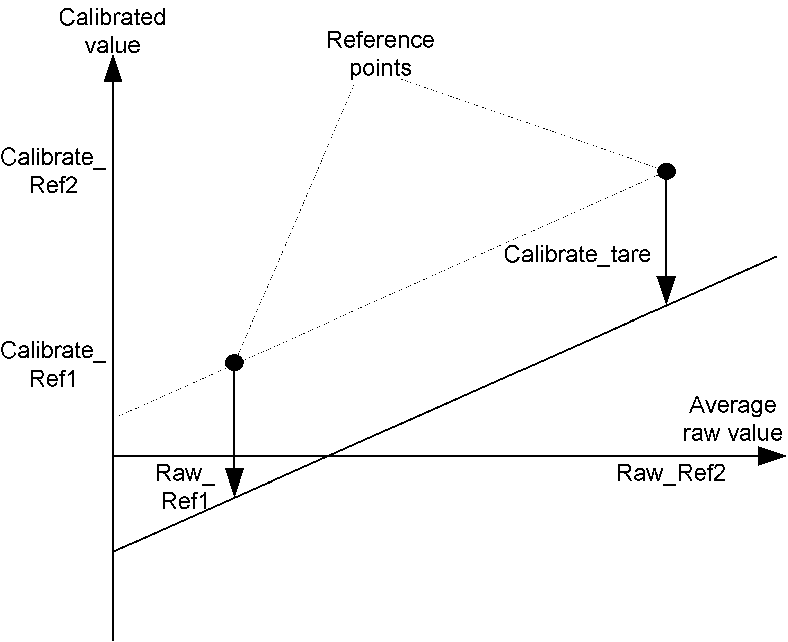

# Taring Procedure

Taring Procedure

This procedure allows you to create an offset to establish a net value when there is a load, or “tare”, measured and indicated by the TMSEAISG module.

The procedure sets the Calibrate\_Tare field of the s\_strainGaugeParameter structure.

NOTE: The tare is derived from the calibrated line.

Follow these steps to tare a TM5SEAISG electronic module:

| Step | Action |
| --- | --- |
| 1 | Create and stabilize the conditions that are representative of the measurement required for the tare. |
| 2 | Set the inputs of the StrainGauge function block to following values:  Tare\_Enable = 1  Ref1\_Enable = 0  Ref2\_Enable = 0 |
| 3 | Set the function block input xExecute to 1. |
| 4 | s\_strainGaugeParameter.Tare is set to the calibrated value calculated by the function block. |

An offset is created on the calibrated line previously defined by both reference points:

