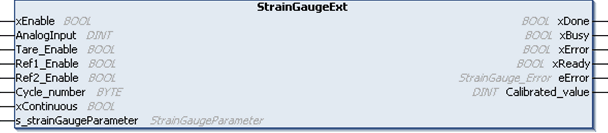

# StrainGaugeExt Function Block Presentation

StrainGaugeExt Function Block Presentation

Overview

The StrainGaugeExt function block is an extended version of the StrainGauge function block, as it provides the capability to make continuous weight measurement on any type of bus (like TM5 and CANopen).

The StrainGaugeExt function block can be used with TM5SEAISG in local, remote and distributed architectures.

The StrainGauge function block has 3 functions:

omake an average measure of the TM5SEAISG input in a defined period

odefine a linear calibration to match the needs of your process

oprovide a calibrated measure

The average raw value is calculated with all the measures done by the TM5SEAISG module during a define number of task cycles. The number of task cycles is set with the Cycle\_Number input of the function block.

Where n is the Cycle\_number value.

StrainGaugeExt Function Block Representation

IL and ST Representation

To see the general representation in IL or ST language, refer to the [Function and Function Block Representation](../Function_and_Function_Block_Representation/Function_and_Function_Block_Representation-1.htm#XREF_D_SE_0002384_1) chapter.

Description of I/O Variables

The table shows the input variables:

| Input | Type | Initial | Comment |
| --- | --- | --- | --- |
| xEnable | BOOL | – | TRUE = action running.  FALSE = action stopped, the outputs xDone, xBusy, xError and iError are reset. |
| AnalogInput | DINT | CST\_INVALID\_VALUE | Raw value given by StrainGauge module.  To be mapped through a variable to AnalogInput00 in:  oI/O Mapping of TM5SEAISG module or;  oCANopen I/O Mapping of the TM5/TM7 DTM if StrainGauge module is used with TM5 CANopen Interface. |
| Tare\_Enable | BOOL | FALSE | TRUE = enables the taring function. |
| Ref1\_Enable | BOOL | FALSE | TRUE = enables the measure of the point reference number 1. |
| Ref2\_Enable | BOOL | FALSE | TRUE = enables the measure of the point reference number 2. |
| Cycle\_number | BYTE | 1 | Number of task cycles that is used to make an average measure of the raw value contained in AnalogInput00 (must be different than 0). |
| xContinuous | BOOL | FALSE | Running mode:  oTRUE = Continuous measurement.  oFALSE = Single measurement. |
| s\_strainGaugeParameter | [StrainGaugeParameter](../Data_Unit_Types/Data_Unit_Types-3.htm#XREF_D_SE_0020700_1) | – | [Taring](../glossary/glossary.htm#XREF_D_SE_0024697_417) and calibration values. |

The table shows the output variables:

| Output | Type | Initial | Comment |
| --- | --- | --- | --- |
| xDone | BOOL | – | TRUE = indicates that the action is successfully completed.  Function block execution is finished. |
| xBusy | BOOL | – | TRUE = indicates that the function block execution is in progress. |
| xError | BOOL | – | TRUE = indicates that an error was detected and the function block aborts the action.  Function block execution is finished. |
| xReady | BOOL | FALSE | TRUE = indicates that the Calibrated\_value is valid. |
| eError | [StainGauge\_Error](../Data_Unit_Types/Data_Unit_Types-2.htm#XREF_D_SE_0020727_1) | 0 | When xError is TRUE: type of the detected error. |
| Calibrated\_value | DINT | CST\_INVALID\_VALUE | Value calculated after the calibration processing of the function block. |

EIO0000003185.01

© 2020 Schneider Electric. All rights reserved.