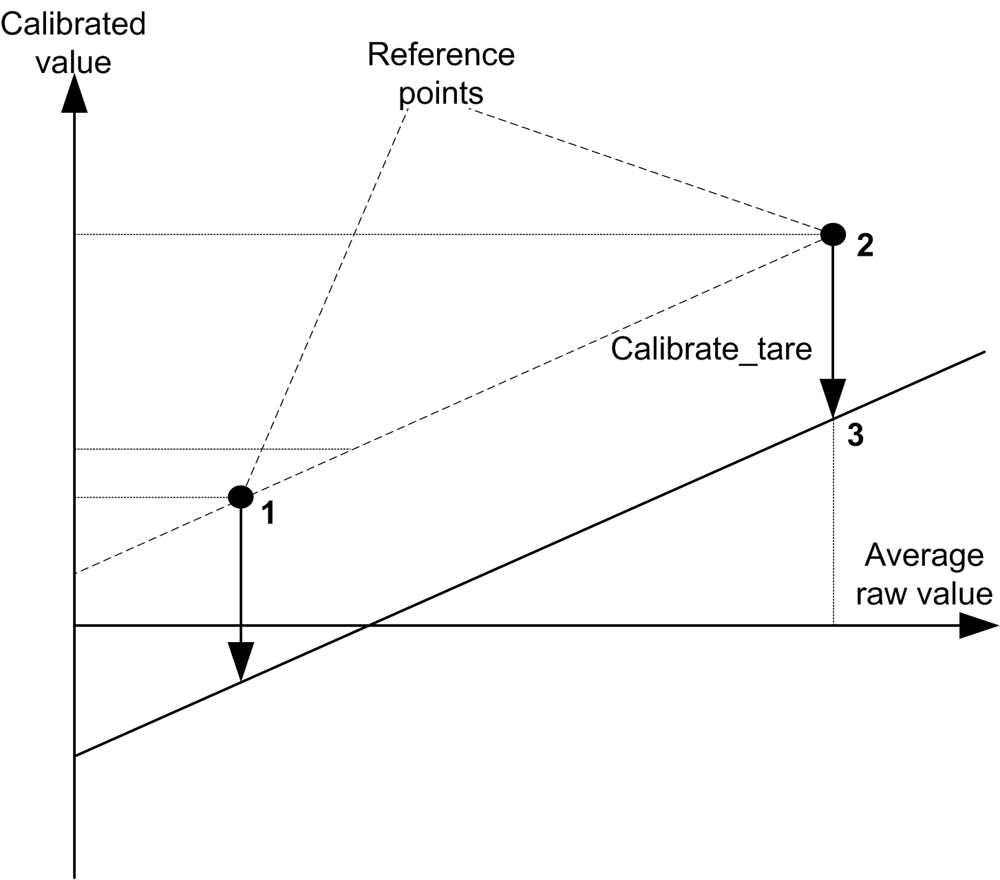

# Linear Calibration

Linear Calibration

Overview

The TM5 StrainGauge function block provides a calibrated measurement. It is necessary to calibrate your system before starting any measurement.

The calibration of your system is done in 3 steps:

| Step | Action |
| --- | --- |
| 1 | Define a first reference point. |
| 2 | Define a second reference point. |
| 3 | Define a [tare](../glossary/glossary.htm#XREF_D_SE_0024697_417). |

The calibrated measure is done by linear interpolation:

The calibrated line is saved in a variable of type [StrainGaugeParameter](../Data_Unit_Types/Data_Unit_Types-3.htm#XREF_D_SE_0020700_1).

NOTE: To define the calibration line, it is recommended to choose two reference points around the nominal measurement value. The first reference point at 10...20% of the nominal value and the second reference point at 50...60% of the nominal value.

EIO0000003185.01

© 2020 Schneider Electric. All rights reserved.