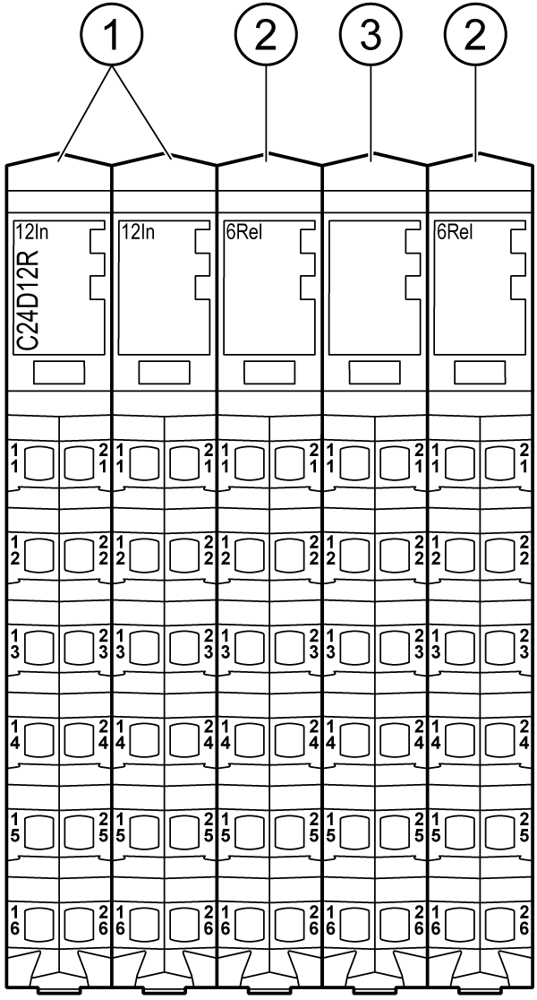

# Presentation

Presentation

The following figure shows the electronic modules of the TM5C24D12R:

| N° | Designation | Refer to |
| --- | --- | --- |
| 1 | Input electronic module / 12 digital inputs | [12In](../Electronic_Modules/Electronic_Modules-5.htm#XREF_D_SE_0009774_1) |
| 2 | Relay output electronic module / 6 relay outputs | [6Rel](../Electronic_Modules/Electronic_Modules-8.htm#XREF_D_SE_0009777_1) |
| 3 | Dummy module | [Dummy Module](../Electronic_Modules/Electronic_Modules-16.htm#XREF_D_SE_0010971_1) |