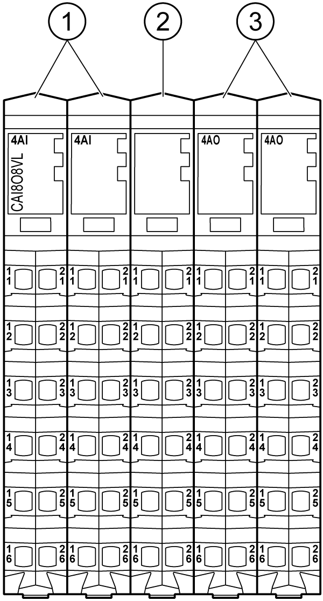

# Presentation

Presentation

The following figure shows the electronic modules of the TM5CAI8O8VL:

| N° | Designation | Refer to |
| --- | --- | --- |
| 1 | Analog Input electronic module / 4 Analog Inputs | [4AI ±10 V](../Electronic_Modules/Electronic_Modules-10.htm#XREF_D_SE_0017891_1) |
| 2 | Dummy Module | [Dummy Module](../Electronic_Modules/Electronic_Modules-16.htm#XREF_D_SE_0010971_1) |
| 3 | Analog Output electronic module / 4 Analog Outputs | [4AO ±10 V](../Electronic_Modules/Electronic_Modules-13.htm#XREF_D_SE_0017893_1) |