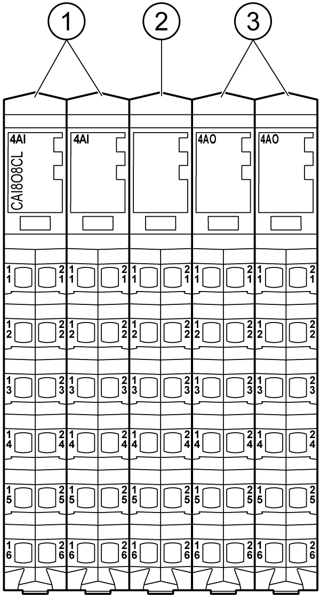

# Presentation

Presentation

The following figure shows the electronic modules of the TM5CAI8O8CL:

| N° | Designation | Refer to |
| --- | --- | --- |
| 1 | Analog Input electronic module / 4 Analog Inputs | [4AI 0-20 mA / 4-20 mA](../Electronic_Modules/Electronic_Modules-11.htm#XREF_D_SE_0017892_1) |
| 2 | Dummy Module | [Dummy Module](../Electronic_Modules/Electronic_Modules-16.htm#XREF_D_SE_0010971_1) |
| 3 | Analog Output electronic module / 4 Analog Outputs | [4AO 0-20 mA](../Electronic_Modules/Electronic_Modules-14.htm#XREF_D_SE_0017894_1) |