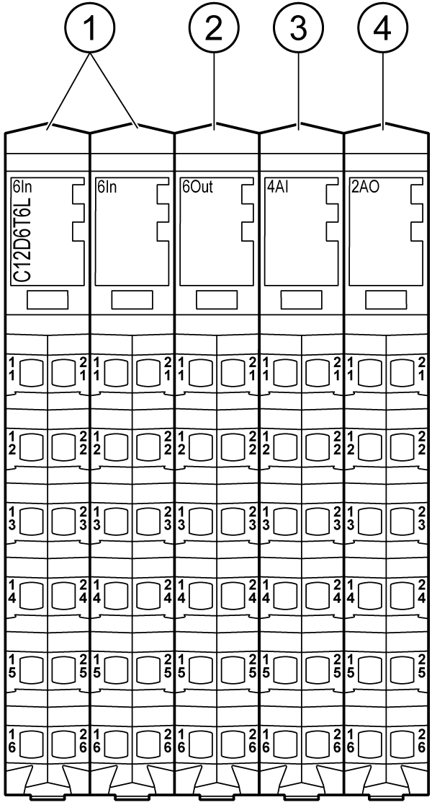

# Presentation

Presentation

The following figure shows the electronic modules of the TM5C12D6T6L:

| N° | Designation | Refer to |
| --- | --- | --- |
| 1 | Input electronic module / 6 digital inputs | [6In](../Electronic_Modules/Electronic_Modules-4.htm#XREF_D_SE_0009773_1) |
| 2 | Output electronic module / 6 digital outputs | [6Out](../Electronic_Modules/Electronic_Modules-7.htm#XREF_D_SE_0009775_1) |
| 3 | Analog Input electronic module / 4 analog inputs | [4AI ±10 V / 0-20 mA](../Electronic_Modules/Electronic_Modules-12.htm#XREF_D_SE_0009776_1) |
| 4 | Analog Output electronic module / 2 analog outputs | [2AO ±10 V / 0-20 mA](../Electronic_Modules/Electronic_Modules-15.htm#XREF_D_SE_0009857_1) |