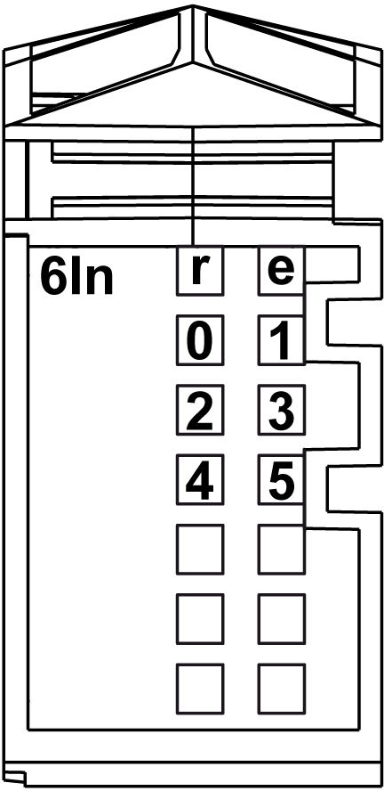

# Status LEDs

Status LEDs

The following figure shows the LEDs for 6In:

The following table shows the 6In status LEDs:

| LEDs | Color | Status | Description |
| --- | --- | --- | --- |
| r | Green | Off | No power supply |
| Single Flash | Reset state |
| Flashing | Preoperational state |
| On | Normal operation |
| e | Red | Off | OK or no power supply |
| e+r | Steady red / single green flash | | Invalid firmware |
| 0-5 | Green | Off | Corresponding input deactivated |
| On | Corresponding input activated |