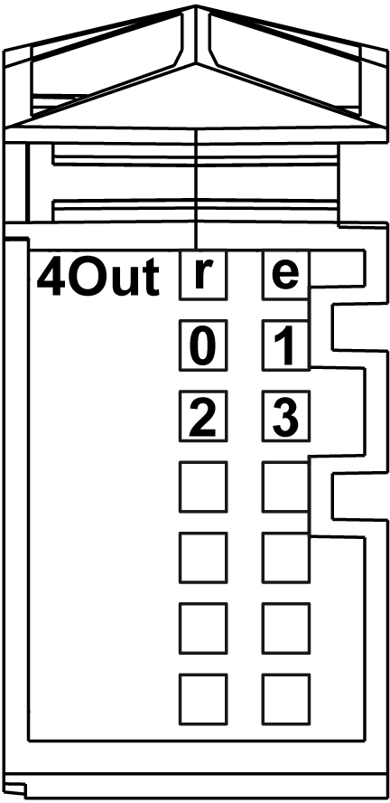

# Status LEDs

Status LEDs

The following figure shows the LEDs for 4Out:

The following table shows the 4Out status LEDs:

| LEDs | Color | Status | Description |
| --- | --- | --- | --- |
| r | Green | Off | No power supply |
| Single Flash | Reset state |
| Flashing | Preoperational state |
| On | Normal operation |
| e | Red | Off | OK or no power supply |
| Single flash | Detected error for an output channel(1) |
| e+r | Steady Red /  Single Green flash | | Invalid firmware |
| 0-3 | Yellow | Off | Corresponding output deactivated |
| On | Corresponding output activated |
| NOTE:  (1) The e LED flashes when detecting one of the following errors on output channels:  oShort circuit  oOverload | | | |