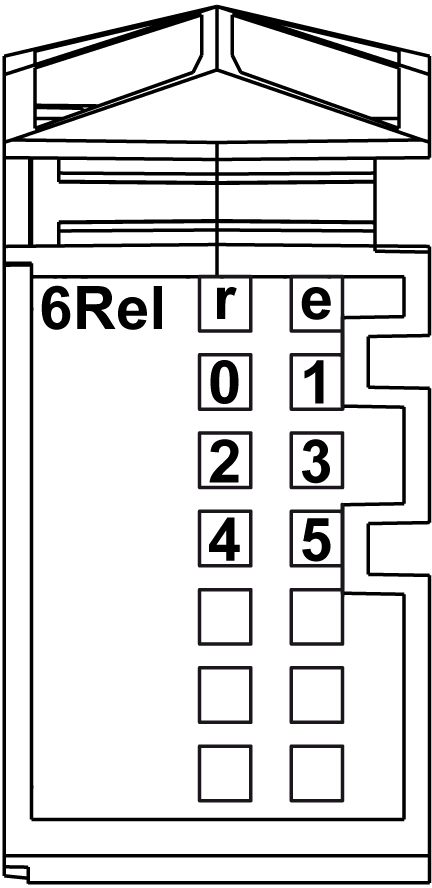

# Status LEDs

Status LEDs

The following figure shows the LEDs for 6Rel:

The following table shows the 6Rel status LEDs:

| LEDs | Color | Status | Description |
| --- | --- | --- | --- |
| r | Green | Off | No power supply |
| Single Flash | Reset state |
| Flashing | Preoperational state |
| On | Normal operation |
| e | Red | Off | OK or no power supply |
| On | Detected error or reset state |
| e+r | Steady red / single green flash | | Invalid firmware |
| 0-5 | Yellow | Off | Corresponding output deactivated |
| On | Corresponding output activated |