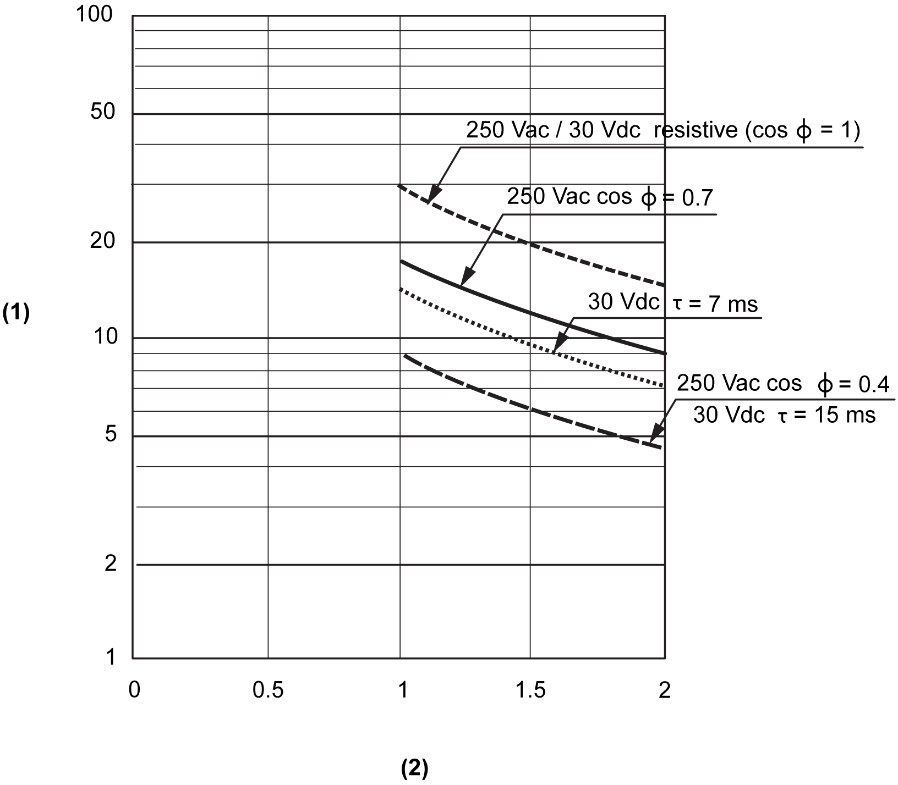

# Electric Durability

Electric Durability

The curves below provide the expected life of the relay contacts for the 6Rel electronic module.

1   Switching procedures (x104)

2   Switching current in A