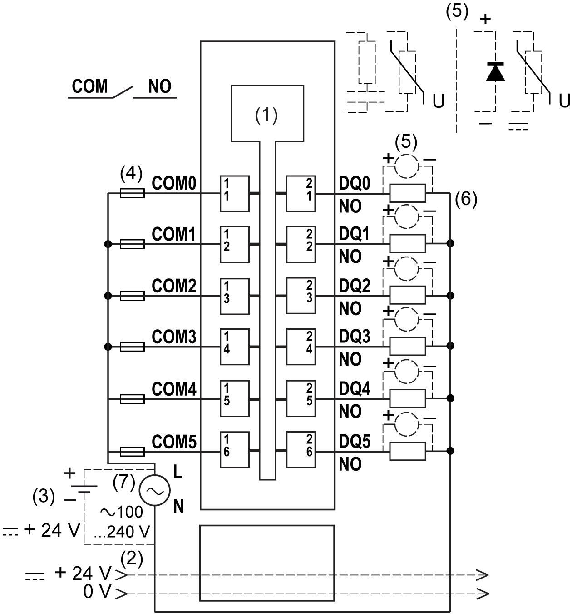

# Wiring Diagram

Wiring Diagram

The following figure shows the wiring diagram of the 6Rel:

1   Internal electronics

2   24 Vdc I/O power segment integrated into the bus bases

3   External isolated power supply 24 Vdc

4   External fuse type T slow-blow 2 A 250 V

5   Inductive load protection

6   2-wire load

7   External power supply 100...240 Vac

|  |
| --- |
| Warning_Color.gifWARNING |
| POTENTIAL OF OVERHEATING AND FIRE |
| oDo not connect the modules directly to line voltage.  oUse only isolating PELV systems according to IEC 61140 to supply power to the modules. |
| Failure to follow these instructions can result in death, serious injury, or equipment damage. |

|  |
| --- |
| Warning_Color.gifWARNING |
| UNINTENDED EQUIPMENT OPERATION |
| Do not connect wires to unused terminals and/or terminals indicated as “No Connection (N.C.)”. |
| Failure to follow these instructions can result in death, serious injury, or equipment damage. |

NOTE: Refer to Protecting Outputs from Inductive Load Damage for additional important information on this topic.