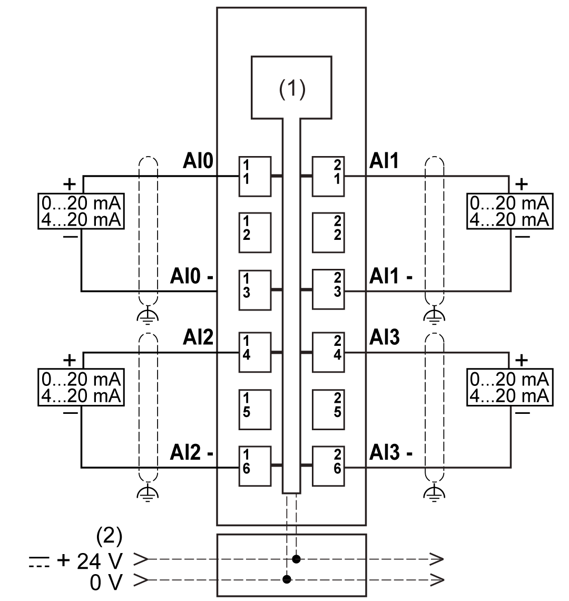

# Wiring Diagram

Wiring Diagram

The following figure shows the wiring diagram of the 4AI 0-20 mA / 4-20 mA:

1   Internal electronics

2   24 Vdc I/O power segment integrated into the bus bases

If you have physically wired the analog channel for a voltage signal and you configure the channel for a current signal in EcoStruxure Machine Expert, you may damage the analog circuit.

|  |
| --- |
| NOTICE |
| INOPERABLE EQUIPMENT |
| Verify that the physical wiring of the analog circuit is compatible with the software configuration for the analog channel. |
| Failure to follow these instructions can result in equipment damage. |

|  |
| --- |
| Warning_Color.gifWARNING |
| UNINTENDED EQUIPMENT OPERATION |
| oUse shielded cables for all fast I/O, analog I/O, and communication signals.  oGround cable shields for all fast I/O, analog I/O, and communication signals at a single point1.  oRoute communications and I/O cables separately from power cables. |
| Failure to follow these instructions can result in death, serious injury, or equipment damage. |

1Multipoint grounding is permissible if connections are made to an equipotential ground plane dimensioned to help avoid cable shield damage in the event of power system short-circuit currents.

For more information, refer to the TM5 System Wiring Rules and Recommendation.

|  |
| --- |
| Warning_Color.gifWARNING |
| UNINTENDED EQUIPMENT OPERATION |
| Do not connect wires to unused terminals and/or terminals indicated as “No Connection (N.C.)”. |
| Failure to follow these instructions can result in death, serious injury, or equipment damage. |