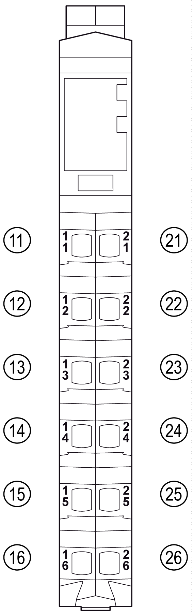

# Physical Description

Physical Description

Overview

The compact I/O module is composed of:

obus base and a set of five electronic modules

oa set of five terminal blocks

The following figure shows the elements of a compact I/O module.

1.Integrated bus base and electronic modules of the compact I/O module (inseparable)

2.Terminal blocks

See also the physical description of the [electronic module and terminal block](../../../../../../api/crossBook?lang=en-US&virtualBookName=m258pig&topicID=D_SE_0009229_4).

NOTE: The terminal blocks associated to the compact I/O block are a 12-pin white terminal block.

|  |
| --- |
| NOTICE |
| ELECTROSTATIC DISCHARGE |
| oNever touch the contacts of the electronic module.  oAlways keep the connector in place during normal operation. |
| Failure to follow these instructions can result in equipment damage. |

Dimensions

The following figure shows the dimensions of a compact I/O module:

Installation

The [installation procedure of the modules](../../../../../../api/crossBook?lang=en-US&virtualBookName=m258pig&topicID=D_SE_0010969_1) is to install and assemble them directly on the DIN rail.

Pin Assignment

The following figure shows the pin assignments for the 12-pin terminal block:

See also the physical description of the [terminal block](../../../../../../api/crossBook?lang=en-US&virtualBookName=m258pig&topicID=D_SE_0001211_7).

Accessories

Refer to the [Installation of Accessories](../../../../../../api/crossBook?lang=en-US&virtualBookName=m258pig&topicID=D_SE_0001024_1).

Labeling

Refer to the [Labeling the TM5 System](../../../../../../api/crossBook?lang=en-US&virtualBookName=m258pig&topicID=D_SE_0001023_1).

EIO0000003191.01

© 2020 Schneider Electric. All rights reserved.