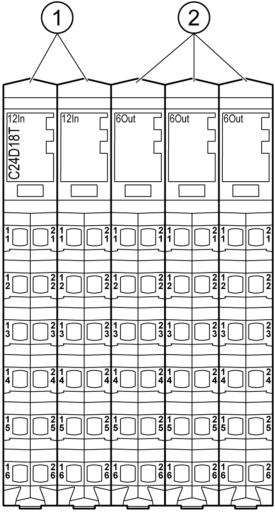

# TM5C24D18T General Description

TM5C24D18T General Description

Presentation

The following figure shows the electronic modules of the TM5C24D18T:

| N° | Designation | Refer to |
| --- | --- | --- |
| 1 | Input electronic module / 12 digital inputs | [12In](../Electronic_Modules/Electronic_Modules-5.htm#XREF_D_SE_0009774_1) |
| 2 | Output electronic module / 6 digital outputs | [6Out](../Electronic_Modules/Electronic_Modules-7.htm#XREF_D_SE_0009775_1) |

General Characteristics

|  |
| --- |
| Warning_Color.gifWARNING |
| UNINTENDED EQUIPMENT OPERATION |
| Do not exceed any of the rated values specified in the environmental and electrical characteristics tables. |
| Failure to follow these instructions can result in death, serious injury, or equipment damage. |

The following table provides the general characteristics of the TM5C24D18T module:

| General characteristics | |
| --- | --- |
| Rated power supply voltage            Power supply source | 24 Vdc  Connected to the 24 Vdc I/O power segment |
| Power supply range | 20.4...28.8 Vdc |
| 24 Vdc I/O power segment current draw | 140 mA |
| Max. current consumed by the loads on the 24 Vdc I/O power segment | 9000 mA |
| Max. current for sensors supply | – |
| Max. current for actuators supply | – |
| TM5 Bus 5 Vdc current draw | 70 mA |
| Power dissipation | 3.71 W max. |
| Weight | 240 g (8.46 oz) |
| Id code for [firmware](../glossary/glossary.htm#XREF_D_SE_0024697_707) update | 45268 dec |

See also [Environmental Characteristics](../TM5_-_General_Rules_for_Implementing/TM5_-_General_Rules_for_Implementing-4.htm#XREF_D_SE_0002647_1).

EIO0000003191.01

© 2020 Schneider Electric. All rights reserved.