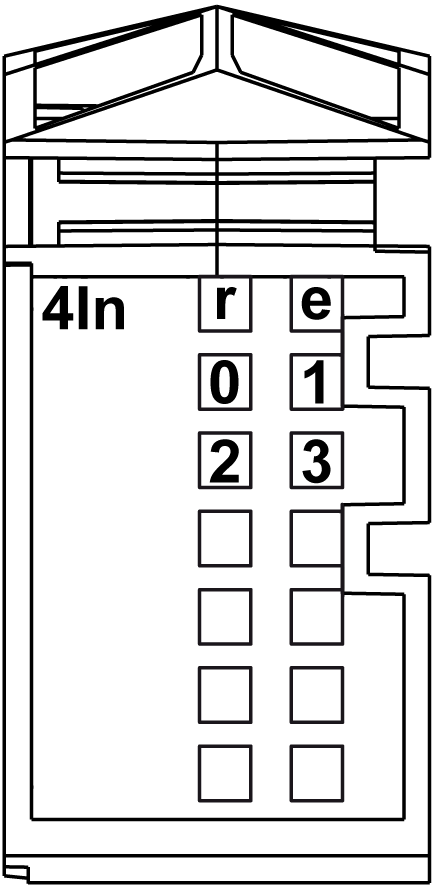
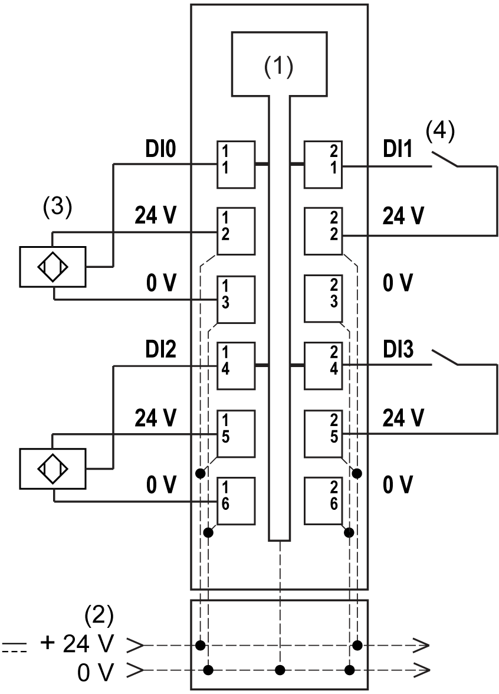

# Digital Input 4In

Digital Input 4In

Overview

The digital 4In electronic module is equipped with 4 sink inputs.

Status LEDs

The following figure shows the LEDs for 4In:

The following table shows the 4In status LEDs:

| LEDs | Color | Status | Description |
| --- | --- | --- | --- |
| r | Green | Off | No power supply |
| Single Flash | Reset state |
| Flashing | Preoperational state |
| On | Normal operation |
| e | Red | Off | OK or no power supply |
| e+r | Steady red / single green flash | | Invalid firmware |
| 0-3 | Green | Off | Corresponding input deactivated |
| On | Corresponding input activated |

Input Characteristics

|  |
| --- |
| Danger_Color.gifDANGER |
| FIRE HAZARD |
| Use only the correct wire sizes for the maximum current capacity of the I/O channels and power supplies. |
| Failure to follow these instructions will result in death or serious injury. |

|  |
| --- |
| Warning_Color.gifWARNING |
| UNINTENDED EQUIPMENT OPERATION |
| Do not exceed any of the rated values specified in the environmental and electrical characteristics tables. |
| Failure to follow these instructions can result in death, serious injury, or equipment damage. |

The following table provides the input characteristics of the 4In electronic module:

| Input Characteristics | | |
| --- | --- | --- |
| Number of input channels | | 4 |
| Wiring type | | 1 or 2 or 3 wires |
| Input type | | Type 1 |
| Signal type | | Sink |
| Rated input voltage | | 24 Vdc |
| Input voltage range | | 20.4...28.8 Vdc |
| Rated input current at 24 Vdc | | 3.75 mA |
| Input impedance | | 6.4 kΩ |
| OFF state | | 5 Vdc max. |
| ON state | | 15 Vdc min. |
| Input filter | Hardware | ≤100 µs |
| Software | Default 1 ms, can be configured between 0 and 25  ms in 0.2 ms intervals. |
| Isolation | Between input and internal bus | See note 1 |
| Between channels | Not isolated |

1 The isolation of the electronic module is 500 Vac RMS between the electronics powered by TM5 power bus and the part powered by 24 Vdc I/O power segment connected to the electronic module. In practice, there is a bridge between TM5 power bus and 24 Vdc I/O power segment. The two power circuits reference the same functional ground (FE) through specific components designed to reduce effects of electromagnetic interference. These components are rated at 30 Vdc or 60 Vdc. This effectively reduces isolation of the entire system from the 500 Vac RMS.

Sensor Supply

The table describes the sensor supply of the 4In electronic module:

| Sensor supply | |
| --- | --- |
| Voltage | Power segment supply less voltage drop for internal protection. |
| Voltage drop for internal protection at 500 mA | 2 Vdc max |
| Sensor supply current (for all powered connected sensors) | 500 mA |
| Internal protection | Overload short circuit |

Wiring Diagram

The following figure shows the wiring diagram of the 4In:

1   Internal electronics

2   24 Vdc I/O power segment integrated into the bus bases

3   3-wire sensor

4   2-wire sensor

|  |
| --- |
| Warning_Color.gifWARNING |
| UNINTENDED EQUIPMENT OPERATION |
| Do not connect wires to unused terminals and/or terminals indicated as “No Connection (N.C.)”. |
| Failure to follow these instructions can result in death, serious injury, or equipment damage. |

|  |
| --- |
| Warning_Color.gifWARNING |
| UNINTENDED EQUIPMENT OPERATION |
| Use the sensor and actuator power supply only for supplying power to sensors or actuators connected to the module. |
| Failure to follow these instructions can result in death, serious injury, or equipment damage. |

EIO0000003191.01

© 2020 Schneider Electric. All rights reserved.