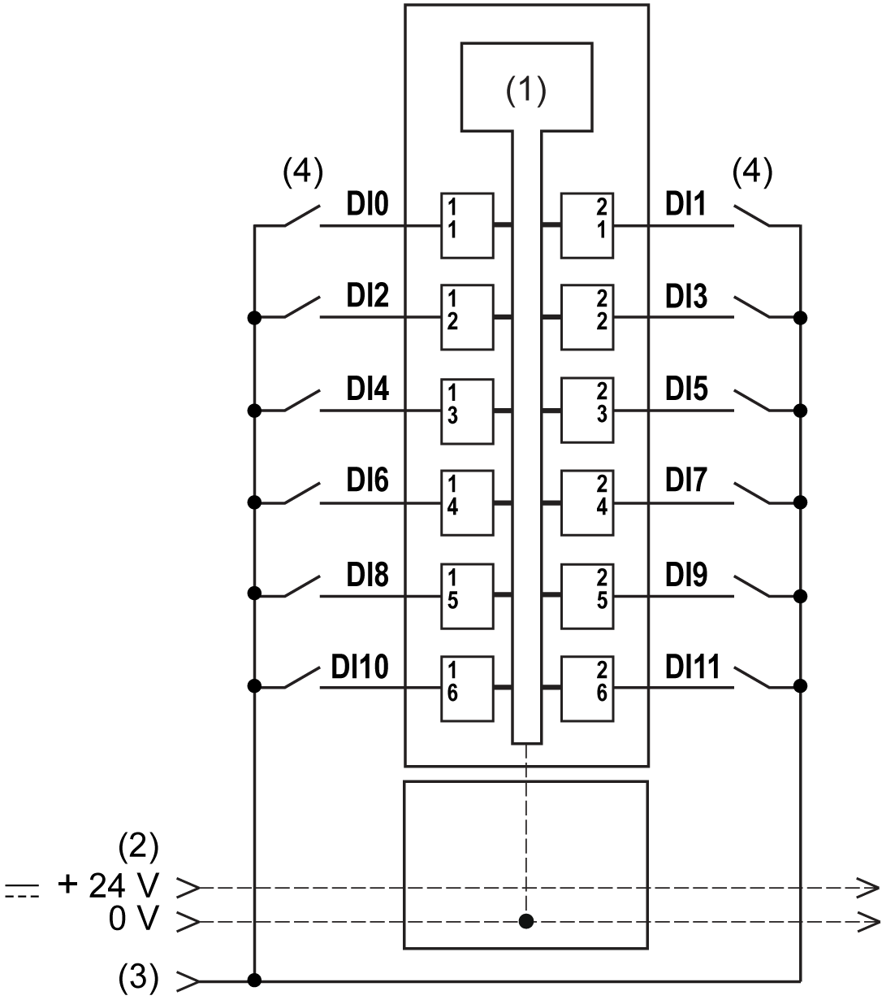

# Digital Input 12In

Digital Input 12In

Overview

The digital 12In electronic module is equipped with 12 sink inputs.

Status LEDs

The following figure shows the LEDs for 12In:

The following table shows the 12In status LEDs:

| LEDs | Color | Status | Description |
| --- | --- | --- | --- |
| r | Green | Off | No power supply |
| Single Flash | Reset state |
| Flashing | Preoperational state |
| On | Normal operation |
| e | Red | Off | OK or no power supply |
| e+r | Steady red / single green flash | | Invalid firmware |
| 0-11 | Green | Off | Corresponding input deactivated |
| On | Corresponding input activated |

Input Characteristics

|  |
| --- |
| Danger_Color.gifDANGER |
| FIRE HAZARD |
| Use only the correct wire sizes for the maximum current capacity of the I/O channels and power supplies. |
| Failure to follow these instructions will result in death or serious injury. |

|  |
| --- |
| Warning_Color.gifWARNING |
| UNINTENDED EQUIPMENT OPERATION |
| Do not exceed any of the rated values specified in the environmental and electrical characteristics tables. |
| Failure to follow these instructions can result in death, serious injury, or equipment damage. |

The following table provides the characteristics of the 12In electronic module:

| Characteristic | | Value |
| --- | --- | --- |
| Number of input channels | | 12 |
| Wiring type | | 1 wire |
| Input type | | Type 1 |
| Signal type | | Sink |
| Rated input voltage | | 24 Vdc |
| Input voltage range | | 20.4...28.8 Vdc |
| De-rating | 55...60 °C (131...140 °F) | 11 channels activated at the same time |
| Rated input current at 24 Vdc | | 3.75 mA |
| Input impedance | | 6.4 kΩ |
| OFF state | | 5 Vdc max. |
| ON state | | 15 Vdc min. |
| Input filter | Hardware | ≤100 µs |
| Software | Default 1 ms, can be configured between 0 and 25  ms in 0.2 ms intervals. |
| Isolation | Between input and internal bus | See note 1 |
| Between channels | Not isolated |

1 The isolation of the electronic module is 500 Vac RMS between the electronics powered by TM5 power bus and the part powered by 24 Vdc I/O power segment connected to the electronic module. In practice, there is a bridge between TM5 power bus and 24 Vdc I/O power segment. The two power circuits reference the same functional ground (FE) through specific components designed to reduce effects of electromagnetic interference. These components are rated at 30 Vdc or 60 Vdc. This effectively reduces isolation of the entire system from the 500 Vac RMS.

Wiring Diagram

The following figure shows the wiring diagram of the 12In:

1   Internal electronics

2   24 Vdc I/O power segment integrated into the bus bases

3   24 Vdc I/O power segment by external connection

4   2-wire sensor

|  |
| --- |
| Warning_Color.gifWARNING |
| UNINTENDED EQUIPMENT OPERATION |
| Do not connect wires to unused terminals and/or terminals indicated as “No Connection (N.C.)”. |
| Failure to follow these instructions can result in death, serious injury, or equipment damage. |

EIO0000003191.01

© 2020 Schneider Electric. All rights reserved.