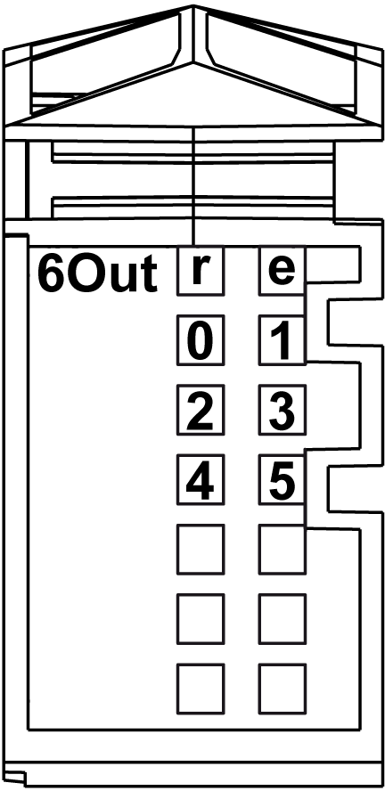
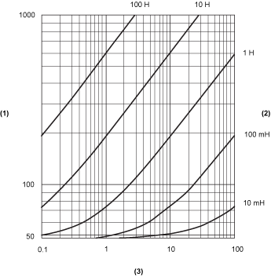
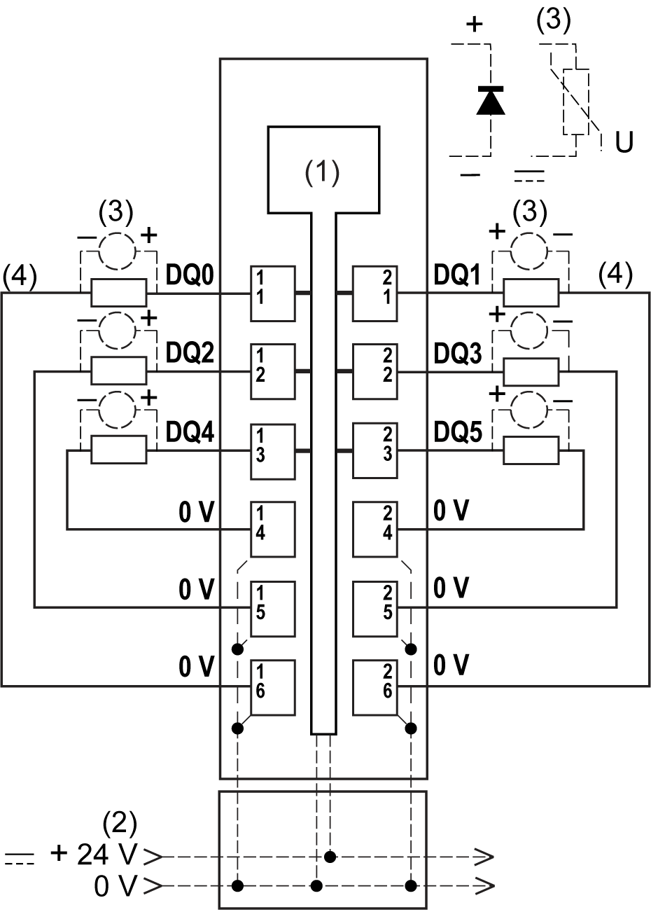

# Digital Output 6Out

Digital Output 6Out

Overview

The digital 6Out electronic module is equipped with 6 source outputs.

Status LEDs

The following figure shows the LEDs for 6Out:

The following table shows the 6Out status LEDs:

| LEDs | Color | Status | Description |
| --- | --- | --- | --- |
| r | Green | Off | No power supply |
| Single Flash | Reset state |
| Flashing | Preoperational state |
| On | Normal operation |
| e | Red | Off | OK or no power supply |
| Single flash | Detected error for an output channel(1) |
| e+r | Steady Red /  Single Green flash | | Invalid firmware |
| 0-5 | Yellow | Off | Corresponding output deactivated |
| On | Corresponding output activated |
| NOTE:  (1) The e LED flashes when detecting one of the following errors on output channels:  oShort circuit  oOverload | | | |

Output Characteristics

|  |
| --- |
| Danger_Color.gifDANGER |
| FIRE HAZARD |
| Use only the correct wire sizes for the maximum current capacity of the I/O channels and power supplies. |
| Failure to follow these instructions will result in death or serious injury. |

|  |
| --- |
| Warning_Color.gifWARNING |
| UNINTENDED EQUIPMENT OPERATION |
| Do not exceed any of the rated values specified in the environmental and electrical characteristics tables. |
| Failure to follow these instructions can result in death, serious injury, or equipment damage. |

For additional important information about fast output protection, refer to Protecting Outputs from Inductive Load Damage.

The following table provides the characteristics of the 6Out electronic module:

| Characteristic | | Value |
| --- | --- | --- |
| Output channels | | 6 |
| Wiring type | | 1 or 2 wires |
| Output type | | Transistor |
| Signal type | | Source |
| Output current | | 0.5 A max. per output |
| Total output current | | 3 A max. |
| Rated output voltage | | 24 Vdc |
| Output voltage range | | 20.4...28.8 Vdc |
| Voltage drop | | 0.3 Vdc max. at 0.5 A rated current |
| Leakage current when switched off | | 5 µA |
| Turn on time | | 300 µs max. |
| Turn off time | | 300 µs max. |
| Output protection | | Against short-circuit and overload, thermal protection |
| Short circuit output peak current | | 12 A max. |
| Automatic rearming after short circuit or overload | | Yes, 10 ms min. depending on internal temperature |
| Protection against reverse polarity | | Yes |
| Clamping voltage | | Typ. 50 Vdc |
| Switching frequency | Resistive load | 500 Hz Max. |
| Inductive load | See the [switching inductive load characteristics](#XREF_D_SE_0009775_13) |
| Isolation | Between input and internal bus | See note 1 |
| Between channels | Not isolated |

1 The isolation of the electronic module is 500 Vac RMS between the electronics powered by TM5 power bus and the part powered by 24 Vdc I/O power segment connected to the electronic module. In practice, there is a bridge between TM5 power bus and 24 Vdc I/O power segment. The two power circuits reference the same functional ground (FE) through specific components designed to reduce effects of electromagnetic interference. These components are rated at 30 Vdc or 60 Vdc. This effectively reduces isolation of the entire system from the 500 Vac RMS.

Switching Inductive Load

The following curves provide the switching inductive load characteristics for the 6Out electronic module.

1   Coil resistance in Ω

2   Coil inductance

3   Max. operating cycles / second

Wiring Diagram

The following figure shows the wiring diagram of the 6Out:

1   Internal electronics

2   24 Vdc I/O power segment integrated into the bus bases

3   Inductive load protection

4   2-wire load

|  |
| --- |
| Warning_Color.gifWARNING |
| UNINTENDED EQUIPMENT OPERATION |
| Do not connect wires to unused terminals and/or terminals indicated as “No Connection (N.C.)”. |
| Failure to follow these instructions can result in death, serious injury, or equipment damage. |

EIO0000003191.01

© 2020 Schneider Electric. All rights reserved.