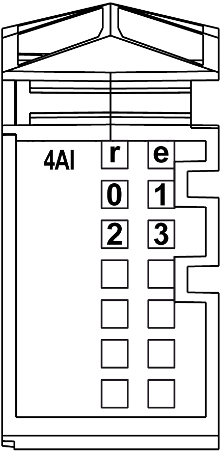
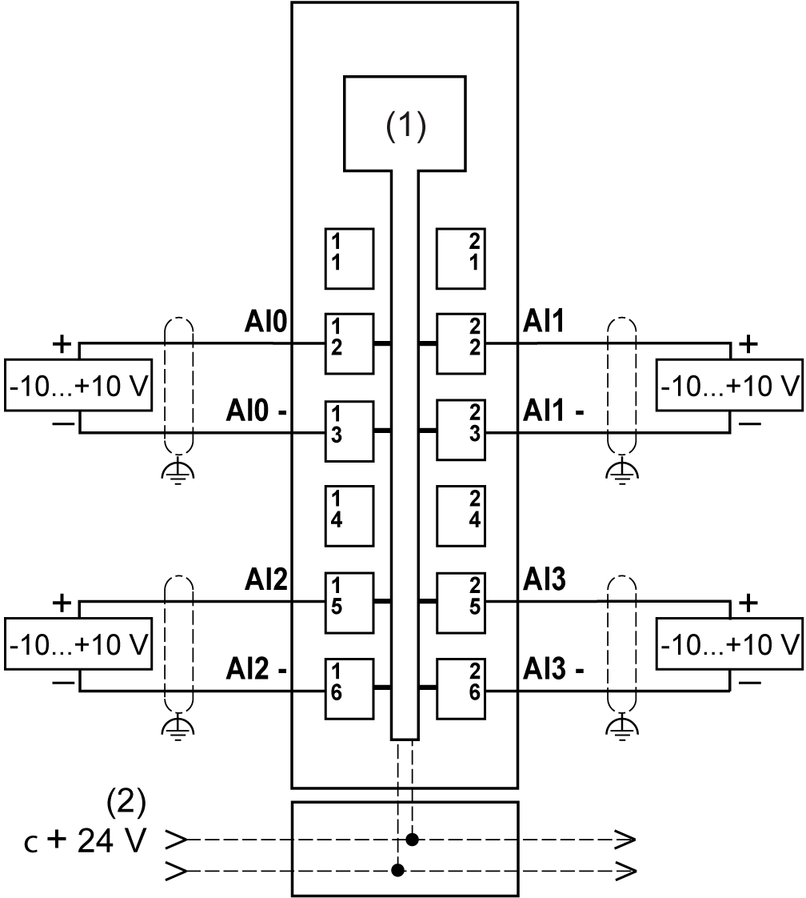

# Analog Input 4AI ±10 V

Analog Input 4AI ±10 V

Overview

The analog 4AI ±10 V electronic module is equipped with 4 12-bit inputs.

Status LEDs

The following figure shows LEDs for 4AI ±10 V:

The following table shows the 4AI ±10 V status LEDs:

| LEDs | Color | Status | Description |
| --- | --- | --- | --- |
| r | Green | Off | No power supply |
| Single Flash | Reset state |
| Flashing | Preoperational state |
| On | Normal operation |
| e | Red | Off | OK or no power supply |
| On | Detected error or reset state |
| Double Flash | System detected error:  oScan time overrun  oSynchronization detected error |
| 0-3 | Green | Off | Channel not configured or open connection or sensor is disconnected |
| On | The analog/digital converter is running, value is available |

Input Characteristics

|  |
| --- |
| Danger_Color.gifDANGER |
| FIRE HAZARD |
| Use only the correct wire sizes for the maximum current capacity of the I/O channels and power supplies. |
| Failure to follow these instructions will result in death or serious injury. |

|  |
| --- |
| Warning_Color.gifWARNING |
| UNINTENDED EQUIPMENT OPERATION |
| Do not exceed any of the rated values specified in the environmental and electrical characteristics tables. |
| Failure to follow these instructions can result in death, serious injury, or equipment damage. |

The following table provides the characteristics of the 4AI ±10 V electronic module:

| Characteristic | | Voltage input |
| --- | --- | --- |
| Number of input channels | | 4 |
| Input range | | -10...10 Vdc |
| Input impedance | | 20 MΩ min. |
| Load impedance | | - |
| Sample duration time | | 20 ms for the whole module  5 ms for one channel |
| Input type | | Differential |
| Conversion mode | | Successive Approximative Register |
| Input filter | | 50 ms, not configurable |
| Input tolerance - maximum deviation at ambient 25° C (77°F) | | < 0.08% of the measurement |
| Input tolerance - temperature drift | | 0.006% / °C of the measurement |
| Input tolerance - non linearity | | < 0.025% of the full scale (20 V) |
| Digital resolution | | 12 bit |
| Resolution value | | 2.441 mV |
| Common mode rejection | | DC |
| 50 Hz |
| Cable type | | Shielded cable required |
| Crosstalk rejection between channels | | 70 dB min. |
| Isolation between channels | | Not isolated |
| Isolation between channels and bus | | See note 1. |
| Permitted input signal | | ±30 Vdc max. |
| Input protection | | Protection against wiring with 24 Vdc supply voltage |
| Common mode voltage allowable between channels | | ±12 Vdc max. |

1 The isolation of the electronic module is 500 Vac RMS between the electronics powered by TM5 power bus and the part powered by 24 Vdc I/O power segment connected to the electronic module. In practice, there is a bridge between TM5 power bus and 24 Vdc I/O power segment. The two power circuits reference the same functional ground (FE) through specific components designed to reduce effects of electromagnetic interference. These components are rated at 30 Vdc or 60 Vdc. This effectively reduces isolation of the entire system from the 500 Vac RMS.

Wiring Diagram

The following figure shows the wiring diagram of the 4AI ±10 V:

1   Internal electronics

2   24 Vdc I/O power segment integrated into the bus bases

U   Voltage

If you have physically wired the analog channel for a voltage signal and you configure the channel for a current signal in EcoStruxure Machine Expert, you may damage the analog circuit.

|  |
| --- |
| NOTICE |
| INOPERABLE EQUIPMENT |
| Verify that the physical wiring of the analog circuit is compatible with the software configuration for the analog channel. |
| Failure to follow these instructions can result in equipment damage. |

|  |
| --- |
| Warning_Color.gifWARNING |
| UNINTENDED EQUIPMENT OPERATION |
| oUse shielded cables for all fast I/O, analog I/O, and communication signals.  oGround cable shields for all fast I/O, analog I/O, and communication signals at a single point1.  oRoute communications and I/O cables separately from power cables. |
| Failure to follow these instructions can result in death, serious injury, or equipment damage. |

1Multipoint grounding is permissible if connections are made to an equipotential ground plane dimensioned to help avoid cable shield damage in the event of power system short-circuit currents.

For more information, refer to the TM5 System Wiring Rules and Recommendation.

|  |
| --- |
| Warning_Color.gifWARNING |
| UNINTENDED EQUIPMENT OPERATION |
| Do not connect wires to unused terminals and/or terminals indicated as “No Connection (N.C.)”. |
| Failure to follow these instructions can result in death, serious injury, or equipment damage. |

EIO0000003191.01

© 2020 Schneider Electric. All rights reserved.