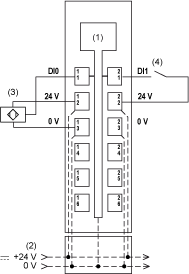

# TM5SDI2D Wiring Diagram

## Wiring Diagram

The following illustration shows the wiring diagram for the TM5SDI2D:

**1** Internal electronics

**2** 24 Vdc I/O power segment integrated into the bus bases

**3** 3-wire sensor

**4** 2-wire sensor

| WARNING | |
| --- | --- |
|  | UNINTENDED EQUIPMENT OPERATION  Do not connect wires to unused terminals and/or terminals indicated as “No Connection (N.C.)”.  Failure to follow these instructions can result in death, serious injury, or equipment damage. |

| WARNING | |
| --- | --- |
|  | UNINTENDED EQUIPMENT OPERATION  Use the sensor and actuator power supply only for supplying power to sensors or actuators connected to the module.  Failure to follow these instructions can result in death, serious injury, or equipment damage. |

EIO0000003197.02