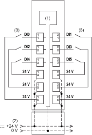
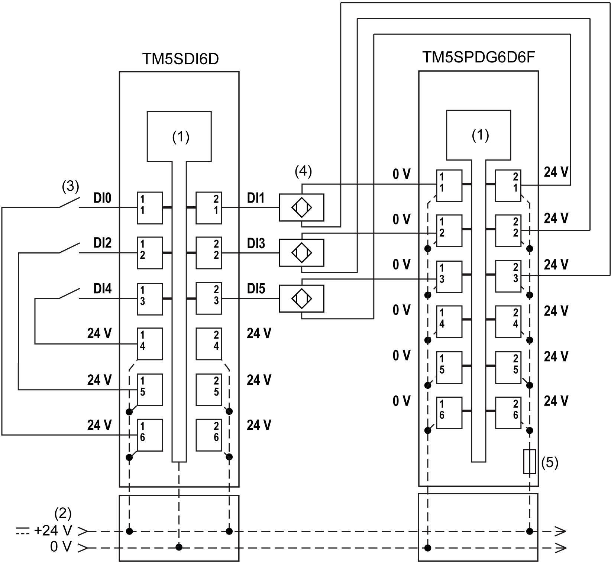

# TM5SDI6D Wiring Diagram

## Wiring Diagram

The following illustration shows the wiring diagram for the TM5SDI6D:

**1** Internal electronics

**2** 24 Vdc I/O power segment integrated into the bus bases

**3** 2-wire sensor

The 6-input TM5SDI6D electronic module can independently support 2-wire devices. To connect 3-wire electronic sensors, you can add a TM5SPDG6D6F Common Distribution module.

The following illustration shows the wiring diagram for the TM5SPDG6D6F and a TM5SDI6D:

**1** Internal electronics

**2** 24 Vdc I/O power segment integrated into the bus bases

**3** 2-wire sensor

**4** 3-wire sensor

**5** Integrated fuse type T slow-blow 6.3 A 250 V exchangeable

| WARNING | |
| --- | --- |
|  | UNINTENDED EQUIPMENT OPERATION  Do not connect wires to unused terminals and/or terminals indicated as “No Connection (N.C.)”.  Failure to follow these instructions can result in death, serious injury, or equipment damage. |

EIO0000003197.02