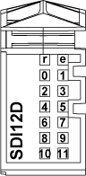

# TM5SDI12D Presentation

## Main Characteristics

The table below describes the main characteristics of the TM5SDI12D electronic module:

| Main Characteristics | |
| --- | --- |
| Number of input channels | 12 |
| Input type | Type 1 |
| Signal type | Sink |
| Rated input voltage | 24 Vdc |

## Ordering Information

The following illustration shows the TM5SDI12D:

The table below shows the model numbers for the terminal block and the bus bases associated with the TM5SDI12D:

| Number | Model Number | Description | Color |
| --- | --- | --- | --- |
| 1 | TM5ACBM11  or  TM5ACBM15 | Bus base  Bus base with address setting | White  White |
| 2 | TM5 SDI12D | Electronic Module | White |
| 3 | TM5ACTB12 | Terminal block, 12 pins | White |

NOTE: For more information, refer to [*TM5 bus bases and terminal blocks*](../../../../../api/crossBook?lang=en-US&virtualBookName=m258pig&topicID=D_SE_0004365).

## Status LEDs

The following illustration shows the LEDs for TM5SDI12D:

The table below shows the TM5SDI12D status LEDs:

| LEDs | Color | Status | Description |
| --- | --- | --- | --- |
| r | Green | Off | No power supply |
| Single Flash | Reset state |
| Flashing | Preoperational state |
| On | Normal operation |
| e | Red | Off | OK or no power supply |
| e+r | Steady red / single green flash | | Invalid firmware |
| 0 - 11 | Green | Off | Corresponding input deactivated |
| On | Corresponding input activated |

EIO0000003197.02