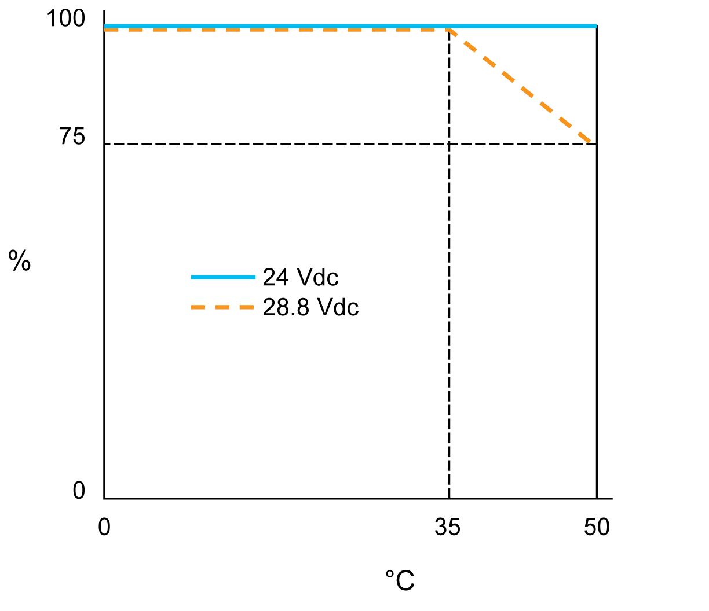
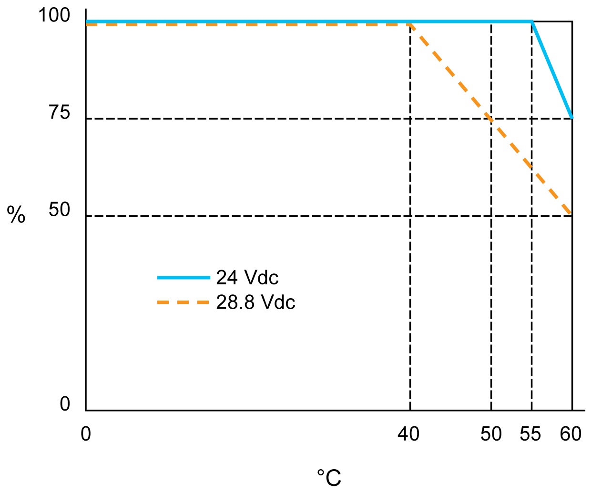

# TM5SDI16D Characteristics

## Introduction

This is the description characteristics for the TM5SDI16D electronic module. See also [Environmental Characteristics](D-SE-0002647.html#D-SE-0002647).

| DANGER | |
| --- | --- |
|  | FIRE HAZARD  * Use only the correct wire sizes for the maximum current capacity of the I/O channels and power supplies. * For relay output (2 A) wiring, use conductors of at least 0.5 mm2 (AWG 20) with a temperature rating of at least 80 °C (176 °F). * For common conductors of relay output wiring (7 A), or relay output wiring greater than 2 A, use conductors of at least 1.0 mm2 (AWG 16) with a temperature rating of at least 80 °C (176 °F).  Failure to follow these instructions will result in death or serious injury. |

| WARNING | |
| --- | --- |
|  | UNINTENDED EQUIPMENT OPERATION  Do not exceed any of the rated values specified in the environmental and electrical characteristics tables.  Failure to follow these instructions can result in death, serious injury, or equipment damage. |

## General Characteristics

The table below describes the general characteristics of the TM5SDI16D electronic module:

| General Characteristics | |
| --- | --- |
| Rated power supply voltage  Power supply source | 24 Vdc  Connected to the 24 Vdc I/O power segment |
| Power supply range | 20.4...28.8 Vdc |
| 24 Vdc I/O segment current draw | 61 mA (all inputs On) |
| TM5 Bus 5 Vdc current draw | 36 mA |
| Power dissipation | 1.65 W maximum |
| Weight | 21 g (0.7 oz) |
| ID code | 56838 dec |

## Input Characteristics

The table describes the input characteristics of the TM5SDI16D electronic module:

| Input Characteristics | | |
| --- | --- | --- |
| Number of input channels | | 16 |
| Wiring type | | 1 wire |
| Rated input voltage | | 24 Vdc |
| Input voltage range | | 20.4...28.8 Vdc |
| De-rating | | See section [De-rating](#D-SE-0028434__D-SE-0028434.8). |
| Rated input current at 24 Vdc | | 2.68 mA |
| Input impedance | | 8.9 kΩ |
| OFF state | | 5 Vdc maximum |
| ON state | | 15 Vdc minimum |
| Input filter | Hardware | ≤100 µs |
| Software | Default 1 ms, can be configured between 0 and 25 ms in 0.2 ms intervals. |
| Isolation | Between input and internal bus | See note 1 |
| Between channels | Not isolated |

1 The isolation of the electronic module is 500 Vac RMS between the electronics powered by the TM5 bus and those powered by 24 Vdc I/O power segment connected to the module. In practice, the TM5 electronic module is installed in the bus base, and there is a bridge between the TM5 power bus and the 24 Vdc I/O power segment. The two power circuits reference the same functional ground (FE) through specific components designed to reduce effects of electromagnetic interference. These components are rated at 30 Vdc or 60 Vdc. This effectively reduces isolation of the entire system from the 500 Vac RMS.

## De-rating of the TM5SDI16D

The following illustration shows the de-rating of simultaneity factor at 24 Vdc and 28.8 Vdc input voltage in vertical installation:

**%** Simultaneity factor

**°C** Ambient temperature

The following illustration shows the de-rating of simultaneity factor at 24 Vdc and 28.8 Vdc input voltage in horizontal installation:

**%** Simultaneity factor

**°C** Ambient temperature

EIO0000003197.02