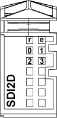

# TM5SDI4A Presentation

## Main Characteristics

The table below describes the main characteristics of the TM5SDI4A electronic module:

| Main Characteristics | |
| --- | --- |
| Number of input channels | 4 |
| Input type | Type 1 |
| Rated input voltage | 100 ... 240 Vac |

## Ordering Information

The following illustration shows the TM5SDI4A:

The table below shows the model numbers for the terminal block and the bus base associated with the TM5SDI4A:

| Number | Model Number | Description | Color |
| --- | --- | --- | --- |
| 1 | TM5ACBM12 | Bus base | Black |
| 2 | TM5SDI4A | Electronic Module | Black |
| 3 | TM5ACTB32 | Terminal block, 12 pins | Black |

NOTE: For more information, refer to [*TM5 bus bases and terminal blocks*](../../../../../api/crossBook?lang=en-US&virtualBookName=m258pig&topicID=D_SE_0004365).

## Status LEDs

The following illustration shows the LEDs for TM5SDI4A:

The table below shows the TM5SDI4A status LEDs:

| LEDs | Color | Status | Description |
| --- | --- | --- | --- |
| r | Green | Off | No power supply |
| Single Flash | Reset state |
| Flashing | Preoperational state |
| On | Normal operation |
| e | Red | Off | OK or no power supply |
| Double Flash | I/O supply too low |
| e+r | Steady red / single green flash | | Invalid firmware |
| 0 - 3 | Green | Off | Corresponding input deactivated |
| On | Corresponding input activated |

EIO0000003197.02