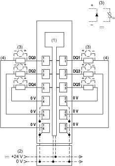

# TM5SDO6T Wiring Diagram

## Wiring Diagram

The following illustration shows the wiring diagram for TM5SDO6T:

**1** Internal electronics

**2** 24 Vdc I/O power segment integrated into the bus bases

**3** Inductive load protection

**4** 2-wire load

| WARNING | |
| --- | --- |
|  | UNINTENDED EQUIPMENT OPERATION  Do not connect wires to unused terminals and/or terminals indicated as “No Connection (N.C.)”.  Failure to follow these instructions can result in death, serious injury, or equipment damage. |

EIO0000003197.02