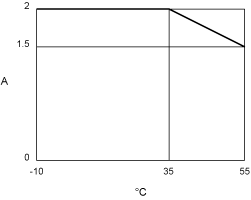
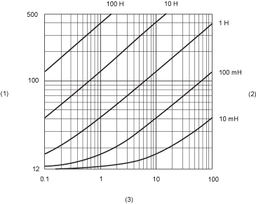

# TM5SDO8TA Characteristics

## Introduction

This is the description characteristics for TM5SDO8TA electronic module.

See also [Environmental Characteristics](D-SE-0002647.html#D-SE-0002647).

| DANGER | |
| --- | --- |
|  | FIRE HAZARD  * Use only the correct wire sizes for the maximum current capacity of the I/O channels and power supplies. * For relay output (2 A) wiring, use conductors of at least 0.5 mm2 (AWG 20) with a temperature rating of at least 80 °C (176 °F). * For common conductors of relay output wiring (7 A), or relay output wiring greater than 2 A, use conductors of at least 1.0 mm2 (AWG 16) with a temperature rating of at least 80 °C (176 °F).  Failure to follow these instructions will result in death or serious injury. |

| WARNING | |
| --- | --- |
|  | UNINTENDED EQUIPMENT OPERATION  Do not exceed any of the rated values specified in the environmental and electrical characteristics tables.  Failure to follow these instructions can result in death, serious injury, or equipment damage. |

## General Characteristics

The table below describes the general characteristics of the TM5SDO8TA electronic module:

| General Characteristics | |
| --- | --- |
| Rated power supply voltage  Power supply source | 24 Vdc(1)  External isolated power supply |
| Power supply range | 20.4...28.8 Vdc |
| 24 Vdc I/O segment current draw | 0 mA |
| TM5 bus 5 Vdc current draw | 44 mA |
| Power dissipation | 1.50 W maximum |
| Weight | 25 g (0.9 oz) |
| ID code for firmware update | 7069 dec |
| **(1)** The output supply is fed directly to the module. There is no connection between the module and the 24 Vdc I/O power segment on the bus base. | |

## Output Characteristics

The table below describes the output characteristics of the TM5SDO8TA electronic module:

| Output Characteristics | | |
| --- | --- | --- |
| Output channels | | 8 |
| Wiring type | | 1 wire |
| Output current | | 2 A maximum per output\* |
| Total output current | | 8 A maximum |
| Output voltage | | 24 Vdc |
| Output voltage range | | 20.4...28.8 Vdc |
| De-rating | - 10...55 °C (14...131 °F) | I = 1.5 A maximum by channel\* |
| 55...60 °C (131...140 °F) | I = 1 A maximum by channel\* |
| Voltage drop | | 0.5 Vdc maximum at 2 A rated current |
| Leakage current when switched off | | 5 µA |
| Turn on time | | 300 µs maximum |
| Turn off time | | 300 µs maximum |
| Output protection | | Against short-circuit and overload, thermal protection |
| Short-circuit output peak current | | 12 A maximum |
| Automatic rearming after short-circuit or overload | | Yes, 10 ms minimum depending on internal temperature |
| Protection against reverse polarity | | Yes |
| Clamping voltage | | Typ. 50 Vdc |
| Switching frequency | Resistive load | 500 Hz Maximum |
| Inductive load | See the [switching inductive load characteristics](#D-SE-0002476__D-SE-0002476.7). |
| Isolation | Between input and internal bus | See note 1 |
| Between channels | Not isolated |
| \*Refer to [De-rating curve of the TM5SDO8TA](#D-SE-0002476__D-SE-0002476.9) | | |

1 The isolation of the electronic module is 500 Vac RMS between the electronics powered by the TM5 bus and those powered by 24 Vdc I/O power segment connected to the module. In practice, the TM5 electronic module is installed in the bus base, and there is a bridge between the TM5 power bus and the 24 Vdc I/O power segment. The two power circuits reference the same functional ground (FE) through specific components designed to reduce effects of electromagnetic interference. These components are rated at 30 Vdc or 60 Vdc. This effectively reduces isolation of the entire system from the 500 Vac RMS.

## De-rating of the TM5SDO8TA

It is possible to obtain the 2 A rating by observing temperature restrictions. Refer to the de-rating graph below. If the modules adjacent to the TM5SDO8TA dissipate no more than 1 W, this graph applies and 2 A / output can be maintained at 35 °C (95 °F).

If the dissipation restriction of adjacent modules is not possible in your configuration, the de-rating must shift by -5 °C (- 9 °F), and 2 A / output can be maintained at 30 °C (86 °F). In most industrial applications, this would require the module to be in an air conditioned enclosure to maintain such temperatures.

## Switching Inductive Loads

The curves below provide the switching inductive load characteristics for the TM5SDO8TA electronic module.

**1** Coil resistance in Ω

**2** Coil inductance

**3** Maximum operating cycles / second

EIO0000003197.02