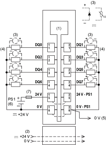

# TM5SDO8TA Wiring Diagram

## Wiring Diagram

The following illustration shows the wiring diagram for the TM5SDO8TA:

**1** Internal electronics

**2** 24 Vdc I/O power segment integrated into the bus bases

**3** Inductive load protection

**4** 2-wire load

**5** 0 Vdc I/O power segment by external connection

**6** PS1: External isolated power supply 24 Vdc(1)

**7** External fuse, Type T slow-blow 8 A maximum, 250 V

**(1)** There is no connection between the module and the 24 Vdc I/O power segment on the bus base.

| WARNING | |
| --- | --- |
|  | POTENTIAL OF OVERHEATING AND FIRE  * Do not connect the modules directly to line voltage. * Use only isolating PELV systems according to IEC 61140 to supply power to the modules.  Failure to follow these instructions can result in death, serious injury, or equipment damage. |

| WARNING | |
| --- | --- |
|  | POTENTIAL EXPLOSION OR FIRE  Connect the returns from the devices to the same power source as the 24 Vdc I/O power segment serving the module.  Failure to follow these instructions can result in death, serious injury, or equipment damage. |

| WARNING | |
| --- | --- |
|  | UNINTENDED EQUIPMENT OPERATION  Do not connect wires to unused terminals and/or terminals indicated as “No Connection (N.C.)”.  Failure to follow these instructions can result in death, serious injury, or equipment damage. |

Refer to [Protecting Outputs from Inductive Load Damage](../../../../../api/crossBook?lang=en-US&virtualBookName=tm5commhw&topicID=D_SE_0002169) for additional important information on this topic.

EIO0000003197.02