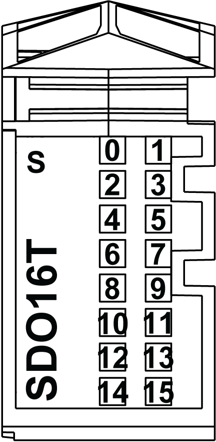

# TM5SDO16T Presentation

## Main Characteristics

The table below describes the main characteristics of the TM5SDO16T electronic module:

| Main Characteristics | |
| --- | --- |
| Number of output channels | 16 |
| Output type | Transistor |
| Signal type | Source |
| Rated input voltage | 24 Vdc |
| Output current | 0.5 A maximum |

## Ordering Information

The following illustration shows the TM5SDO16T:

The table below shows the model numbers for the terminal block and the bus bases associated with the TM5SDO16T:

| Number | Model Number | Description | Color |
| --- | --- | --- | --- |
| 1 | TM5ACBM11 | Bus base | White  White |
| 2 | TM5SDO16T | Electronic Module | White |
| 3 | TM5ACTB16 | Terminal block, 16 pins | White |

NOTE: For more information, refer to [*TM5 bus bases and terminal blocks*](../../../../../api/crossBook?lang=en-US&virtualBookName=m258pig&topicID=D_SE_0004365).

## Status LEDs

The following illustration shows LEDs for TM5SDO16T:

The table below shows the TM5SDO16T status LEDs:

| LEDs | Color | Status | Description |
| --- | --- | --- | --- |
| s | Green | Off | No power supply |
| Single Flash | Reset state |
| Flashing | Preoperational state |
| On | Normal operation |
| Red | Off | OK or no power supply |
| Single flash | Error detected on output channels(1) |
| Steady Red /  Single Green flash | | Invalid firmware |
| 0 - 15 | Yellow | Off | Corresponding output deactivated |
| On | Corresponding output activated |
| (1) When the diagnostic of the outputs is activated, the s LED flashes when detecting one of the following errors on output channels:  * Short -circuit * Overload * Status of output not corresponding to the command status | | | |

EIO0000003197.02