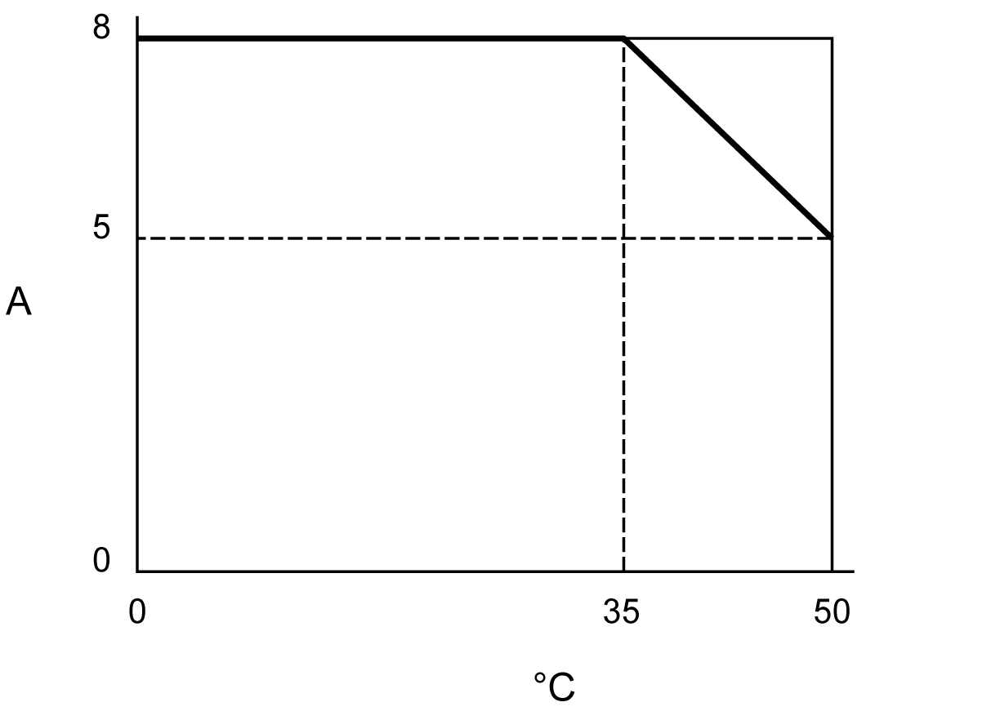
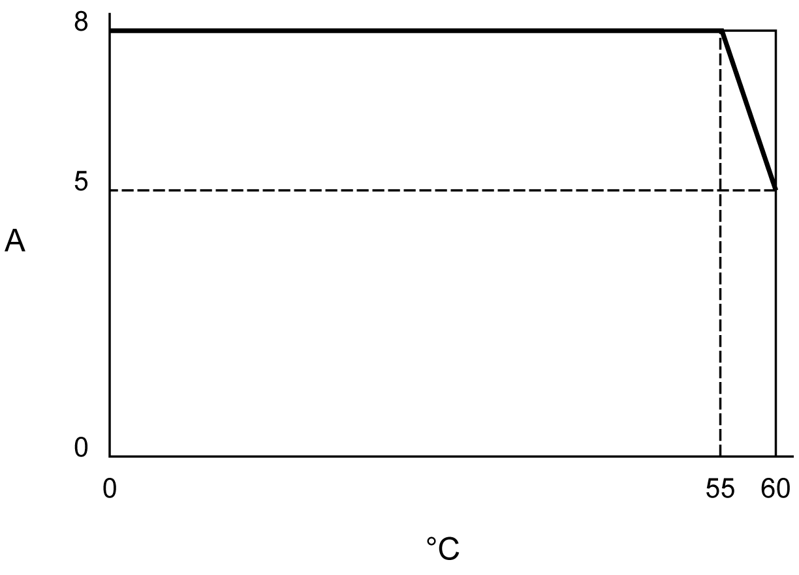
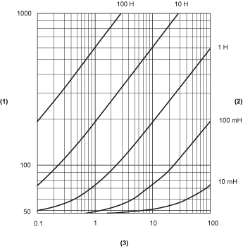

# TM5SDO16T Characteristics

## Introduction

This is the description characteristics for the TM5SDO16T electronic module.

See also [Environmental Characteristics](D-SE-0002647.html#D-SE-0002647).

| DANGER | |
| --- | --- |
|  | FIRE HAZARD  * Use only the correct wire sizes for the maximum current capacity of the I/O channels and power supplies. * For relay output (2 A) wiring, use conductors of at least 0.5 mm2 (AWG 20) with a temperature rating of at least 80 °C (176 °F). * For common conductors of relay output wiring (7 A), or relay output wiring greater than 2 A, use conductors of at least 1.0 mm2 (AWG 16) with a temperature rating of at least 80 °C (176 °F).  Failure to follow these instructions will result in death or serious injury. |

| WARNING | |
| --- | --- |
|  | UNINTENDED EQUIPMENT OPERATION  Do not exceed any of the rated values specified in the environmental and electrical characteristics tables.  Failure to follow these instructions can result in death, serious injury, or equipment damage. |

## General Characteristics

The table below describes the general characteristics of the TM5SDO16T electronic module:

| General Characteristics | |
| --- | --- |
| Rated power supply voltage  Power supply source | 24 Vdc  Connected to the 24 Vdc I/O power segment |
| Power supply range | 20.4...28.8 Vdc |
| 24 Vdc I/O segment current draw | 40 mA |
| TM5 bus 5 Vdc current draw | 56 mA |
| Power dissipation | 1.79 W maximum |
| Weight | 24 g (0.8 oz) |
| ID code for firmware update | 56839 dec |

## Output Characteristics

The table below describes the output characteristics of the TM5SDO16T electronic module:

| Output Characteristics | | |
| --- | --- | --- |
| Output channels | | 16 |
| Wiring type | | 1 wire |
| Output current | | 0.5 A maximum per output |
| Total output current | | 8 A maximum |
| Output voltage | | 24 Vdc |
| Output voltage range | | 20.4...28.8 Vdc |
| De-rating | | See section Current de-rating |
| Voltage drop | | 0.1 Vdc maximum at 0.5 A rated current |
| Leakage current when switched off | | 5 µA |
| Turn on time | | 300 µs maximum |
| Turn off time | | 300 µs maximum |
| Output diagnostic | | Output monitoring with 10 ms delay, the function is activated or desactivated by software. |
| Output protection | | Against short-circuit and overload, thermal protection |
| Short -circuit output peak current | | 3 A maximum |
| Automatic rearming after short -circuit or overload | | Yes, 10 ms minimum depending on internal temperature |
| Protection against reverse polarity | | Yes |
| Clamping voltage | | Typ. 45 Vdc |
| Switching frequency | Resistive load | 500 Hz Maximum |
| Inductive load | See the [switching inductive load characteristics](D-SE-0002478.html#D-SE-0002478__D-SE-0002478.7). |
| Isolation | Between input and internal bus | See note 1 |
| Between channels | Not isolated |

1 The isolation of the electronic module is 500 Vac RMS between the electronics powered by the TM5 bus and those powered by 24 Vdc I/O power segment connected to the module. In practice, the TM5 electronic module is installed in the bus base, and there is a bridge between the TM5 power bus and the 24 Vdc I/O power segment. The two power circuits reference the same functional ground (FE) through specific components designed to reduce effects of electromagnetic interference. These components are rated at 30 Vdc or 60 Vdc. This effectively reduces isolation of the entire system from the 500 Vac RMS.

## Current de-rating

The following illustration shows the current de-rating in vertical installation:

**A** Total current

**°C** Ambient temperature

The following illustration shows the current de-rating in horizontal installation:

**A** Total current

**°C** Ambient temperature

## Switching Inductive Loads

The curves below provide the switching inductive load characteristics for the TM5SDO16T electronic module.

**1** Load resistance in Ω

**2** Load inductance

**3** Maximum operating cycles / second

EIO0000003197.02