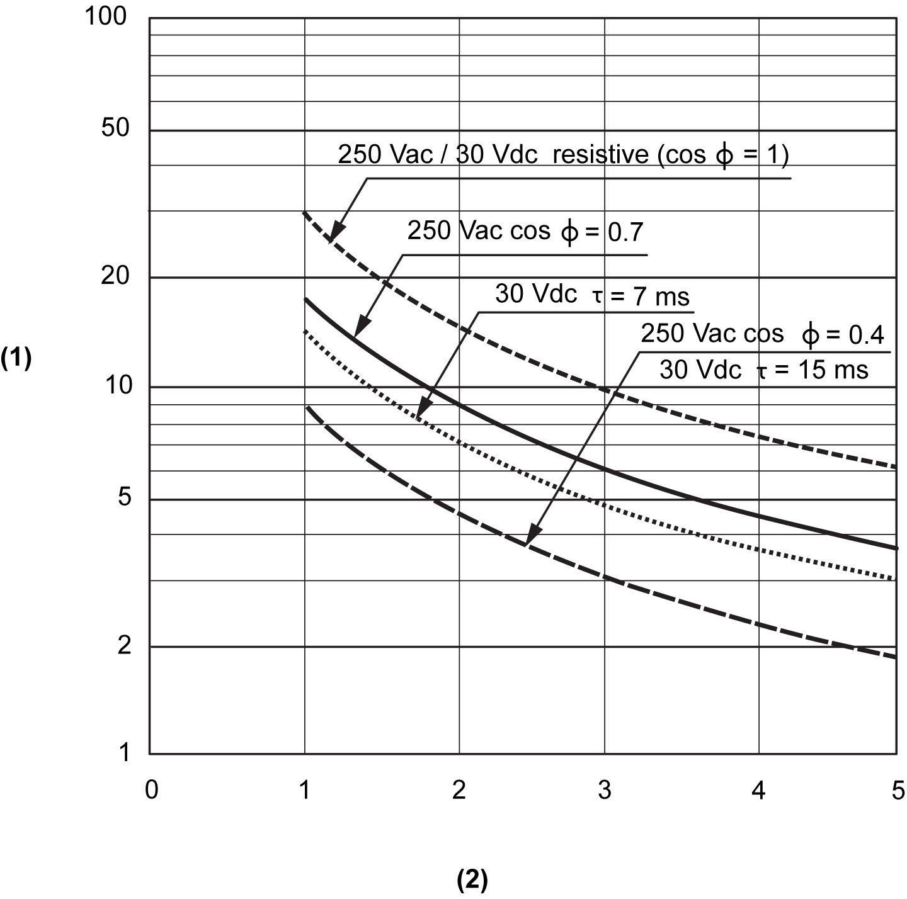

# TM5SDO4R Characteristics

## Introduction

This is the description characteristics for the TM5SDO4R electronic module.

See also [Environmental Characteristics](D-SE-0002647.html#D-SE-0002647).

| DANGER | |
| --- | --- |
|  | FIRE HAZARD  * Use only the correct wire sizes for the maximum current capacity of the I/O channels and power supplies. * For relay output (2 A) wiring, use conductors of at least 0.5 mm2 (AWG 20) with a temperature rating of at least 80 °C (176 °F). * For common conductors of relay output wiring (7 A), or relay output wiring greater than 2 A, use conductors of at least 1.0 mm2 (AWG 16) with a temperature rating of at least 80 °C (176 °F).  Failure to follow these instructions will result in death or serious injury. |

| WARNING | |
| --- | --- |
|  | UNINTENDED EQUIPMENT OPERATION  Do not exceed any of the rated values specified in the environmental and electrical characteristics tables.  Failure to follow these instructions can result in death, serious injury, or equipment damage. |

## General Characteristics

The table below describes the general characteristics of the TM5SDO4R electronic module:

| General Characteristics | |
| --- | --- |
| Rated power supply voltage  Power supply source | 30 Vdc / 230 Vac  Connected to an external AC or DC power |
| Power supply range | 24 Vdc ... 36 Vdc  184 Vac ... 276 Vac |
| 24 Vdc I/O segment current draw | 0 mA (N.C.) |
| TM5 bus 5 Vdc current draw | 160 mA |
| Power dissipation | 2.30 W maximum |
| Weight | 30 g (1.1 oz) |
| ID code for firmware update | 42756 dec |

## Output Characteristics

The table below describes the output characteristics of the TM5SDO4R electronic module:

| Output Characteristics | | |
| --- | --- | --- |
| Output channels | | 4 |
| Wiring type | | 4 (C/O) contacts |
| Output current | | 5 A maximum per output at 30 Vdc  5 A maximum per output at 230 Vac |
| Total output current | | 10 A maximum at 30 Vdc  10 A maximum at 230 Vac |
| Output voltage | | 30 Vdc / 230 Vac |
| Output voltage range | | 24 Vdc ... 36 Vdc  184 Vac ... 276 Vac |
| Turn on time | | 10 ms maximum |
| Turn off time | | 10 ms maximum |
| Protective circuit | Internal | None |
| External  DC  AC | Inverse diode, RC combination or VDR  RC combination or VDR |
| Automatic rearming after short- circuit or overload | | Yes, 10 ms minimum depending on internal temperature |
| Switching capacity | Minimum | 10 mA at 5 Vdc |
| Maximum | 150 W / 1250 VA |
| Protection against reverse polarity | | Yes |
| Isolation | Between channels and bus | See note 1 |
| Between outputs | Not isolated |
| Mechanical durability | | Typically 2x107cycles or more |

1 The isolation of the electronic module is 500 Vac RMS between the electronics powered by the TM5 bus and those powered by 24 Vdc I/O power segment connected to the module. In practice, the TM5 electronic module is installed in the bus base, and there is a bridge between the TM5 power bus and the 24 Vdc I/O power segment. The two power circuits reference the same functional ground (FE) through specific components designed to reduce effects of electromagnetic interference. These components are rated at 30 Vdc or 60 Vdc. This effectively reduces isolation of the entire system from the 500 Vac RMS.

If your controller or module contains relay outputs, these types of outputs can support up to 240 Vac. Inductive damage to these types of outputs can result in welded contacts and loss of control. Each inductive load must include a protection device such as a peak limiter, RC circuit or flyback diode. Capacitive loads are not supported by these relays.

| WARNING | |
| --- | --- |
|  | RELAY OUTPUTS WELDED CLOSED  * Always protect relay outputs from inductive alternating current load damage using an appropriate external protective circuit or device. * Do not connect relay outputs to capacitive loads.  Failure to follow these instructions can result in death, serious injury, or equipment damage. |

## Electric Durability

The curves below provide the expected life of the relay contacts for the TM5SDO2R electronic module.

**1** Switching procedures (x104)

**2** Switching current in A

EIO0000003197.02