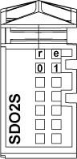

# TM5SDO2S Presentation

## Main Characteristics

The table below describes the main characteristics of the TM5SDO2S electronic module:

| Main Characteristics | |
| --- | --- |
| Number of output channels | 2 |
| Output type | Triac |
| Signal type | Source |
| Rated output voltage | 100...240 Vac |
| Output current | 1 A maximum |

## Ordering Information

The following illustration shows the TM5SDO2S:

The table below shows the model numbers for the terminal block and the bus base associated with the TM5SDO2S:

| Number | Model Number | Description | Color |
| --- | --- | --- | --- |
| 1 | TM5ACBM12 | Bus base | Black |
| 2 | TM5SDO2S | Electronic Module | Black |
| 3 | TM5ACTB32 | Terminal block, 12 pins | Black |

NOTE: For more information, refer to [*TM5 bus bases and terminal blocks*](../../../../../api/crossBook?lang=en-US&virtualBookName=m258pig&topicID=D_SE_0004365).

## Status LEDs

The following illustration shows LEDs for TM5SDO2S:

The table below shows the TM5SDO2S diagnostic LEDs:

| LEDs | Color | Status | Description |
| --- | --- | --- | --- |
| r | Green | Off | No external power supply |
| Single Flash | Reset state |
| Flashing | Preoperational state |
| On | Normal operation |
| e | Red | Off | OK or no external power supply |
| On | Error detected or reset state |
| Single flash | Zero cross-over signal has dropped out.1 |
| e+r | Steady Red /  Single Green flash | | Invalid firmware |
| 0 - 1 | Yellow | Off | Corresponding output deactivated |
| On | Corresponding output activated |

1 Zero cross-over detection is activated at the first zero crossover after being switched on .

EIO0000003197.02