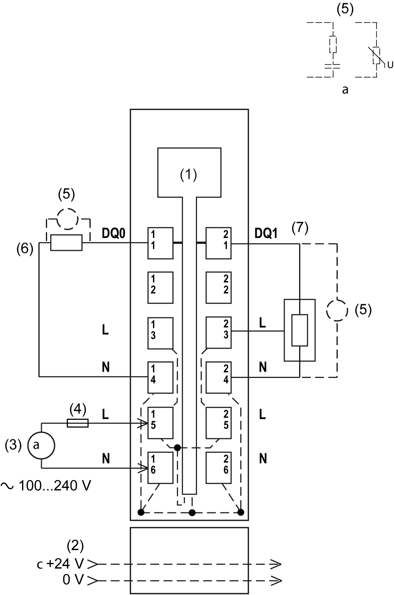

# TM5SDO2S Wiring Diagram

## Wiring Diagram

The following illustration shows the wiring diagram for TM5SDO2S:

**1** Internal electronics

**2** 24 Vdc I/O power segment integrated into the bus bases

**3** External power supply 100...240 Vac

**4** External fuse type T slow-blow 3.15 A - 250 V

**5** Inductive load protection

**6** 2-wire load

**7** 3-wire load

| WARNING | |
| --- | --- |
|  | UNINTENDED EQUIPMENT OPERATION  Do not connect wires to unused terminals and/or terminals indicated as “No Connection (N.C.)”.  Failure to follow these instructions can result in death, serious injury, or equipment damage. |

| WARNING | |
| --- | --- |
|  | UNINTENDED EQUIPMENT OPERATION  Use the sensor and actuator power supply only for supplying power to sensors or actuators connected to the module.  Failure to follow these instructions can result in death, serious injury, or equipment damage. |

Refer to [Protecting Outputs from Inductive Load Damage](../../../../../api/crossBook?lang=en-US&virtualBookName=tm5commhw&topicID=D_SE_0002169) for additional important information on this topic.

EIO0000003197.02