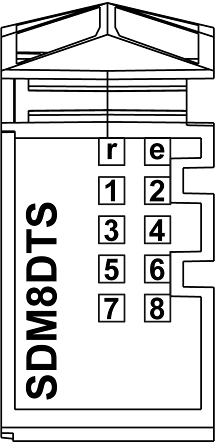

# TM5SDM8DTS Presentation

## Overview

The TM5SDM8DTS electronic module has been designed for use with PacDrive 3 systems supporting TM5 Sercos III bus interface TM5NS31. You can configure the modules to support oversampled input and outputs or time stamped inputs and oversampled outputs. For more information, refer to the document *TM5SDM8DTS Parameter Description*.

The time stamped inputs of the TM5SDM8DTS electronic module are used by PacDrive 3 in support of the touchprobe functionality. Throughout the documentation, the time stamped inputs of this module are often referred to as touchprobe inputs.

Given that the TM5SDM8DTS electronic module has been designed and optimized exclusively for use with PacDrive 3 applications, certain product characteristics for this module differ from those of other TM5 modules.

For more information, see [TM5SDM8DTS Characteristics](D-SE-0053657.html#D-SE-0053657).

## Main Characteristics

The table below describes the main characteristics of the TM5SDM8DTS electronic module:

| Main characteristics | |
| --- | --- |
| Number of digital input channels  (configurable as time stamped input or oversampled input) | 4 |
| Input type | Refer to the [*Input Characteristics* table](D-SE-0053657.html#D-SE-0053657__D-SE-0053657.6). |
| Input signal type | Sink |
| Number of digital output channels  (configurable as oversampled output) | 4 |
| Output type | Transistor |
| Output signal type | Source |
| Output current | 0.1 A per output |
| Rated input voltage | 24 Vdc |

NOTE: Use the TM5SDM8DTS electronic module only with PacDrive 3 and TM5 Sercos III bus interface TM5NS31.

## Ordering Information

The illustration below shows the TM5SDM8DTS:

The table below shows the references for the terminal block and the bus bases associated with the TM5SDM8DTS:

| Number | Reference | Description | Color |
| --- | --- | --- | --- |
| 1 | TM5ACBM11  or  TM5ACBM15 | Bus base  Bus base with address setting | White  White |
| 2 | TM5SDM8DTS | Electronic module | White |
| 3 | TM5ACTB12 | Terminal block, 12 pins | White |

NOTE: For more information, refer to [*TM5 bus bases and terminal blocks*](../../../../../api/crossBook?lang=en-US&virtualBookName=m258pig&topicID=D_SE_0004365).

## Status LEDs

The following illustration describes the LEDs for TM5SDM8DTS:

The table below shows the TM5SDM8DTS input status LEDs:

| LED | Color | Status | Description |
| --- | --- | --- | --- |
| r | Green | Off | No power supply |
| Single flash | Reset state |
| Flashing | Preoperational state |
| On | Normal operation |
| e | Red | Off | OK or no power supply |
| On | Error detected or reset state |
| Double flash | One of the following errors has been detected:   * Oversampled output control error * Oversampled output copy error * Edge detect poll cycle error * Error on edge generator unit 1...4 |
| 1 - 8 | Green |  | Status of the corresponding digital signal |

EIO0000003197.02