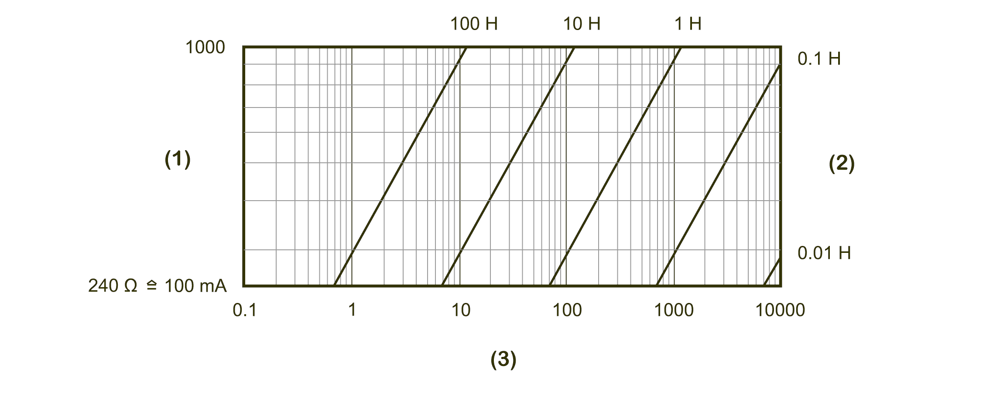

# TM5SDM8DTS Characteristics

## Introduction

This is the description characteristics for the TM5SDM8DTS electronic module. See also [Environmental Characteristics](D-SE-0002647.html#D-SE-0002647).

| DANGER | |
| --- | --- |
|  | FIRE HAZARD  * Use only the correct wire sizes for the maximum current capacity of the I/O channels and power supplies. * For relay output (2 A) wiring, use conductors of at least 0.5 mm2 (AWG 20) with a temperature rating of at least 80 °C (176 °F). * For common conductors of relay output wiring (7 A), or relay output wiring greater than 2 A, use conductors of at least 1.0 mm2 (AWG 16) with a temperature rating of at least 80 °C (176 °F).  Failure to follow these instructions will result in death or serious injury. |

| WARNING | |
| --- | --- |
|  | UNINTENDED EQUIPMENT OPERATION  Do not exceed any of the rated values specified in the environmental and electrical characteristics tables.  Failure to follow these instructions can result in death, serious injury, or equipment damage. |

## General Characteristics

The table below describes the general characteristics of the TM5SDM8DTS electronic module:

| General characteristics | | |
| --- | --- | --- |
| Rated power supply voltage  Power supply source | | 24 Vdc  Connected to the 24 Vdc I/O power segment |
| Power supply range | | 20.4...28.8 Vdc |
| 24 Vdc I/O segment current draw | | 62.5 mA |
| TM5 bus 5 Vdc current draw | | 2 mA |
| Power dissipation | | 1.51 W maximum |
| Weight | | 22 g (0.8 oz) |
| ID code for firmware update | | 43323 dec |

## Input Characteristics

The table describes the input characteristics of the TM5SDM8DTS electronic module:

| Input characteristics | | |
| --- | --- | --- |
| Number of input channels | | 4 inputs |
| Wiring type | | 1 wire |
| Rated input voltage | | 24 Vdc |
| Input voltage range | | 20.4...28.8 Vdc |
| Rated input current at 24 Vdc | | 1.3 mA |
| Input impedance | | 18.4 kΩ |
| OFF state | | < 5 Vdc |
| ON state | | > 15 Vdc |
| Input circuit | | Sink |
| Input frequency | | 40 kHz |
| Additional functions | | * 4x time stamping units with time stamp function * 4x input oversampling |
| Input filter | Hardware | ≥ 2 μs |
| Software | – |
| Isolation | Between channels and bus | See note 1 |
| Between channels | Not isolated |

1 The isolation of the electronic module is 500 Vac RMS between the electronics powered by the TM5 bus and those powered by 24 Vdc I/O power segment connected to the module. In practice, the TM5 electronic module is installed in the bus base, and there is a bridge between the TM5 power bus and the 24 Vdc I/O power segment. The two power circuits reference the same functional ground (FE) through specific components designed to reduce effects of electromagnetic interference. These components are rated at 30 Vdc or 60 Vdc. This effectively reduces isolation of the entire system from the 500 Vac RMS.

## Output Characteristics

The table describes the output characteristics of the TM5SDM8DTS electronic module:

| Output characteristics | | |
| --- | --- | --- |
| Output channels | | 4 outputs |
| Wiring type | | 1 wire |
| Output current | | 0.1 A maximum per output |
| Total output current | | 0.4 A |
| Output voltage | | 24 Vdc |
| Output voltage range | | 20.4...28.8 Vdc |
| Output circuit | | Sink and/or source |
| Output protection | | * Thermal cutoff for overcurrent and short-circuit * Integrated protection for switching inductances |
| Additional functions | | * 4x edge generation with μs precision * 4x output oversampling |
| Voltage drop | | < 0.9 V at 0.1 A rated current |
| Leakage current when switched off | | maximum 25 µA |
| Turn on time | | < 2 µs |
| Turn off time | | < 2 µs |
| Automatic rearming after short-circuit or overload | | Yes, 10 ms minimum depending on internal temperature |

## Time Stamping

The table describes the time stamping units characteristics of the TM5SDM8DTS electronic module:

| Characteristics | | |
| --- | --- | --- |
| Number of time stamping units | | 4 |
| Input frequency (maximum) | | 40 kHz |
| Resolution | | 1 µs time stamp function |
| Signal form | | Square wave pulse |
| Sensor supply | | Module-internal, maximum 600 mA |

## Oversampling

The table describes the oversampling characteristics of the TM5SDM8DTS electronic module:

| Characteristics | | |
| --- | --- | --- |
| Number of oversampling units | | 4 |
| Sample time | | 125 µs, 250 µs, 500 µs depending on Sercos cycle time |

## Switching Inductive Loads

The curves below provide the switching inductive load characteristics for the TM5SDM8DTS electronic module.

**1** Load resistance in Ω

**2** Load inductance

**3** Maximum operating cycles / second (with 90% duty cycle)

EIO0000003197.02