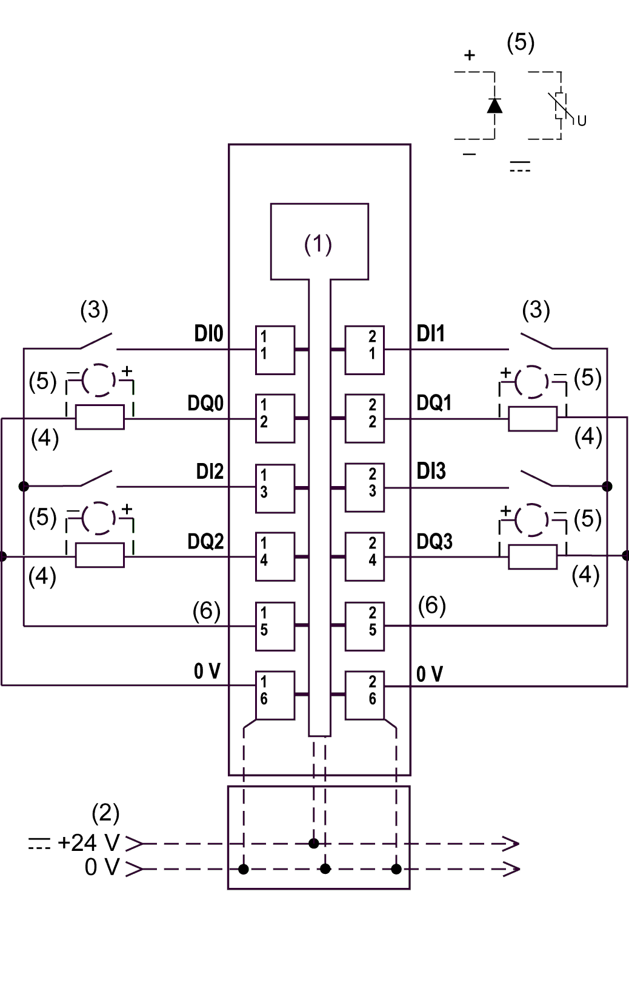

# TM5SDM8DTS Wiring Diagram

## Wiring Diagram

The following illustration presents the wiring diagram for the TM5SDM8DTS:

**1** Internal electronics

**2** 24 Vdc I/O power segment integrated into the bus bases

**3** 2-wire sensor

**4** 2-wire load

**5** Inductive load protection

**6** 24 Vdc for sensor supply

NOTE: I/O electronic modules and the field devices connected to them must all reside on the same 24 Vdc I/O power segment. If not, the status LEDs may not function correctly. In addition, there may potentially be more significant consequences such as an explosion and/or fire hazard.

| WARNING | |
| --- | --- |
|  | POTENTIAL EXPLOSION OR FIRE  Connect the returns from the devices to the same power source as the 24 Vdc I/O power segment serving the module.  Failure to follow these instructions can result in death, serious injury, or equipment damage. |

| WARNING | |
| --- | --- |
|  | UNINTENDED EQUIPMENT OPERATION  Do not connect wires to unused terminals and/or terminals indicated as “No Connection (N.C.)”.  Failure to follow these instructions can result in death, serious injury, or equipment damage. |

| WARNING | |
| --- | --- |
|  | UNINTENDED EQUIPMENT OPERATION  Use the sensor and actuator power supply only for supplying power to sensors or actuators connected to the module.  Failure to follow these instructions can result in death, serious injury, or equipment damage. |

EIO0000003197.02