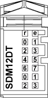

# TM5SDM12DT Presentation

## Main Characteristics

The table below describes the main characteristics of the TM5SDM12DT electronic module:

| Main Characteristics | |
| --- | --- |
| Number of input channels | 8 |
| Input type | Type 1 |
| Input signal type | Sink |
| Number of output channels | 4 |
| Output type | Transistor |
| Output signal type | Source |
| Output current | 0.5 A maximum |
| Rated input voltage | 24 Vdc |

## Ordering Information

The illustration below shows the TM5SDM12DT:

The table below shows the model numbers for the terminal block and the bus bases associated with the TM5SDM12DT:

| Number | Model Number | Description | Color |
| --- | --- | --- | --- |
| 1 | TM5ACBM11  or  TM5ACBM15 | Bus base  Bus base with address setting | White  White |
| 2 | TM5SDM12DT | Electronic Module | White |
| 3 | TM5ACTB12 | Terminal block, 12 pins | White |

NOTE: For more information, refer to [*TM5 bus bases and terminal blocks*](../../../../../api/crossBook?lang=en-US&virtualBookName=m258pig&topicID=D_SE_0004365).

## Status LEDs

The following illustration describes the LEDs for TM5SDM12DT:

The table below shows the TM5SDM12DT input status LEDs:

| LED | Color | Status | Description |
| --- | --- | --- | --- |
| r | Green | Off | No power supply |
| Single flash | Reset state |
| Flashing | Preoperational state |
| On | Normal operation |
| e | Red | Off | OK or no power supply |
| Single flash | Error detected on output channels 1 |
| e+r | Steady red / Single green flash | | Invalid firmware |
| 0 - 7 | Green | Off | Corresponding input deactivated |
| On | Corresponding input activated |
| 0 - 3 | Yellow | Off | Corresponding output deactivated |
| On | Corresponding output activated |
| NOTE: The e LED flashes when detecting one of the following errors on output channels:  * Short-circuit * Overload * No 24 Vdc Power Segment supply and an output is at logic 1 | | | |

EIO0000003197.02