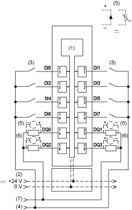
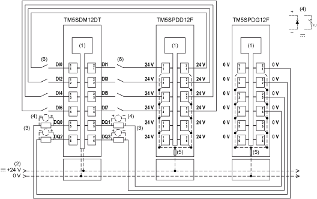

# TM5SDM12DT Wiring Diagram

## Wiring Diagram

The following illustration shows the wiring diagram for the TM5SDM12DT:

**1** Internal electronics

**2** 24 Vdc I/O power segment integrated into the bus bases

**3** 2-wire sensor

**4** 24 Vdc I/O power segment by external connection

**5** Inductive load protection

**6** 2-wire load

**7** 0 Vdc I/O power segment by external connection

NOTE: I/O electronic modules and the field devices connected to them must all reside on the same 24 Vdc I/O power segment. If not, the status LEDs may not function correctly. In addition, there may potentially be more significant consequences such as an explosion and/or fire hazard.

| WARNING | |
| --- | --- |
|  | POTENTIAL EXPLOSION OR FIRE  Connect the returns from the devices to the same power source as the 24 Vdc I/O power segment serving the module.  Failure to follow these instructions can result in death, serious injury, or equipment damage. |

The 8-input / 4-output TM5SDM12DT electronic module can independently support 1-wire devices. To connect 2-wire devices, you can add TM5SPDD12F and TM5SPDG12F Common Distribution modules.

The following illustration shows the wiring diagram for the TM5SPDD12F, TM5SPDG12F and the TM5SDM12DT:

**1** Internal electronics

**2** 24 Vdc I/O power segment integrated into the bus bases

**3** 2-wire load

**4** Inductive load protection

**5** Integrated fuse type T slow-blow 6.3 A 250 V exchangeable

**6** 2-wire sensor

| WARNING | |
| --- | --- |
|  | UNINTENDED EQUIPMENT OPERATION  Do not connect wires to unused terminals and/or terminals indicated as “No Connection (N.C.)”.  Failure to follow these instructions can result in death, serious injury, or equipment damage. |

EIO0000003197.02