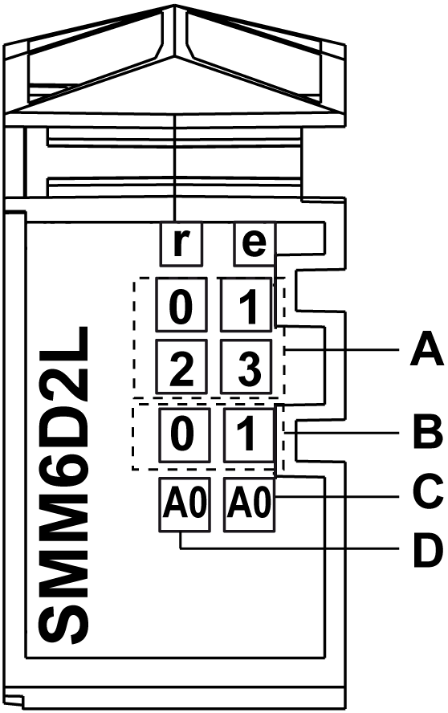

# TM5SMM6D2L Presentation

## Main Characteristics

The tables describe the main characteristics of the TM5SMM6D2L electronic module:

| Main Characteristics of Digital Input / Output Channels | |
| --- | --- |
| Number of digital input channels | 4 |
| Number of digital output channels | 2 |
| Input type | Type 1 |
| Input signal type | Sink |
| Rated input voltage | 24 Vdc |
| Output type | Transistor |
| Output signal type | Source |
| Output current | 0.5 A maximum |

| Main Characteristics of Analog Input / Output Channels | | |
| --- | --- | --- |
| Number of analog input channels | 1 | |
| Number of analog output channels | 1 | |
| Signal type | Voltage | Current |
| Input range | -10...+10 Vdc | 0...20 mA / 4...20 mA |
| Output range | -10...+10 Vdc | 0...20 mA |
| Resolution | 12 bits + sign | 12 bits |

## Ordering Information

The illustration shows the TM5SMM6D2L:

The table shows the model numbers for the terminal block and the bus bases associated with the TM5SMM6D2L:

| Number | Reference | Description | Color |
| --- | --- | --- | --- |
| 1 | TM5ACBM11  or  TM5ACBM15 | Bus base  Bus base with address setting | White  White |
| 2 | TM5SMM6D2L | Electronic module | White |
| 3 | TM5ACTB12 | Terminal block, 12 pins | White |

NOTE: For more information, refer to [*TM5 bus bases and terminal blocks*](../../../../../api/crossBook?lang=en-US&virtualBookName=m258pig&topicID=D_SE_0004365).

## Status LEDs

The following illustration describes the LEDs for TM5SMM6D2L:

The table shows the TM5SMM6D2L input status LEDs:

| Position in Illustration | LED | Color | Status | Description |
| --- | --- | --- | --- | --- |
| – | r | Green | Off | No power supply |
| Single flash | Reset state |
| Flashing | Preoperational state |
| On | Normal operation |
| – | e | Red | Off | OK or no power supply |
| Single flash | Error detected on output channels |
| – | e+r | Steady red / Single green flash | | Invalid firmware |
| A | 0 - 3 | Green | Off | Corresponding digital input deactivated |
| On | Corresponding digital input activated |
| B | 0 - 1 | Orange | Off | Corresponding digital output deactivated |
| On | Corresponding digital output activated |
| C | A0 | Orange | Off | The value = 0. |
| On | The value ≠ 0. |
| D | A0 | Green | Off | The connection is open or the sensor is disconnected. |
| Flashing | Overflow or underflow of the input signal |
| On | The analog / digital converter is running, the value is OK. |

EIO0000003197.02