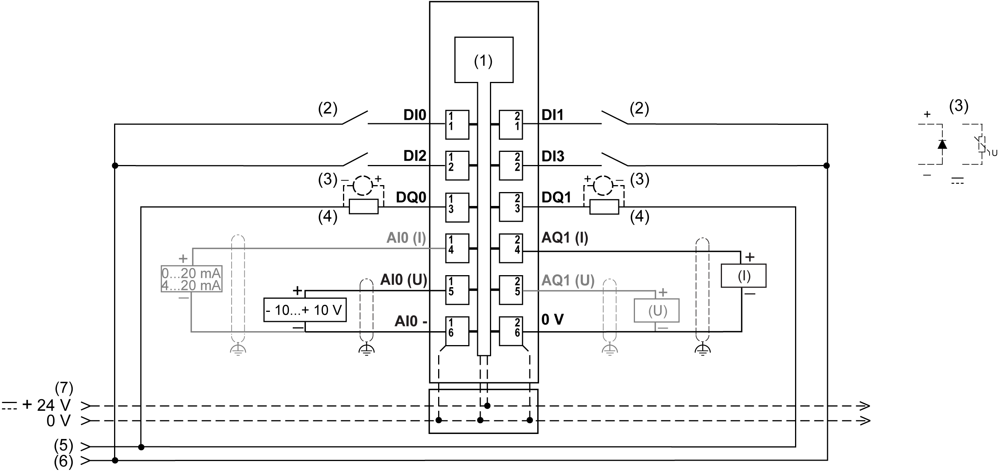

# TM5SMM6D2L Wiring Diagram

## Wiring Diagram

The following illustration shows the wiring diagram for TM5SMM6D2L:

**1** internal electronics

**2** 2-wire sensor

**3** inductive load protection

**4** 2-wire load

**5** 0 Vdc I/O power segment by external connection

**6** 24 Vdc I/O power segment by external connection

**7** 24 Vdc I/O power segment integrated into the bus bases

**I** current

**U** voltage

| WARNING | |
| --- | --- |
|  | UNINTENDED EQUIPMENT OPERATION  Do not connect wires to unused terminals and/or terminals indicated as “No Connection (N.C.)”.  Failure to follow these instructions can result in death, serious injury, or equipment damage. |

## Specific Information for Digital Inputs

NOTE: I/O electronic modules and the field devices connected to them must all reside on the same 24 Vdc I/O power segment. If not, the status LEDs may not function correctly. In addition, there may potentially be more significant consequences such as an explosion and/or fire hazard.

| WARNING | |
| --- | --- |
|  | POTENTIAL EXPLOSION OR FIRE  Connect the returns from the devices to the same power source as the 24 Vdc I/O power segment serving the module.  Failure to follow these instructions can result in death, serious injury, or equipment damage. |

The 4-digital input TM5SMM6D2L electronic module can independently support 1-wire devices. To connect 2-wire devices, you can add a TM5SPDD12F Common Distribution module.

## Specific Information for Analog Inputs

Use shielded, properly grounded cables for all analog and high-speed inputs or outputs and communication connections. If you do not use shielded cable for these connections, electromagnetic interference can cause signal degradation. Degraded signals can cause the controller or attached modules and equipment to perform in an unintended manner.

| WARNING | |
| --- | --- |
|  | UNINTENDED EQUIPMENT OPERATION  * Use shielded cables for all fast I/O, analog I/O and communication signals. * Ground cable shields for all analog I/O, fast I/O and communication signals at a single point1. * Route communication and I/O cables separately from power cables.  Failure to follow these instructions can result in death, serious injury, or equipment damage. |

1Multipoint grounding is permissible if connections are made to an equipotential ground plane dimensioned to help avoid cable shield damage in the event of power system short-circuit currents.

| NOTICE | |
| --- | --- |
|  | INOPERABLE EQUIPMENT  Verify that the physical wiring of the analog circuit is compatible with the software configuration for the analog channel.  Failure to follow these instructions can result in equipment damage. |

## Specific Information for Digital Outputs

NOTE: I/O electronic modules and the field devices connected to them must all reside on the same 24 Vdc I/O power segment. If not, the status LEDs may not function correctly. In addition, there may potentially be more significant consequences such as an explosion and/or fire hazard.

| WARNING | |
| --- | --- |
|  | POTENTIAL EXPLOSION OR FIRE  Connect the returns from the devices to the same power source as the 24 Vdc I/O power segment serving the module.  Failure to follow these instructions can result in death, serious injury, or equipment damage. |

The 2-digital output TM5SMM6D2L electronic module can independently support 1-wire devices. To connect 2-wire devices, you can add a TM5SPDG12F Common Distribution module.

## Specific Information for Analog Output

Use shielded, properly grounded cables for all analog and high-speed inputs or outputs and communication connections. If you do not use shielded cable for these connections, electromagnetic interference can cause signal degradation. Degraded signals can cause the controller or attached modules and equipment to perform in an unintended manner.

| WARNING | |
| --- | --- |
|  | UNINTENDED EQUIPMENT OPERATION  * Use shielded cables for all fast I/O, analog I/O and communication signals. * Ground cable shields for all analog I/O, fast I/O and communication signals at a single point1. * Route communication and I/O cables separately from power cables.  Failure to follow these instructions can result in death, serious injury, or equipment damage. |

1Multipoint grounding is permissible if connections are made to an equipotential ground plane dimensioned to help avoid cable shield damage in the event of power system short-circuit currents.

| NOTICE | |
| --- | --- |
|  | INOPERABLE EQUIPMENT  Verify that the physical wiring of the analog circuit is compatible with the software configuration for the analog channel.  Failure to follow these instructions can result in equipment damage. |

EIO0000003197.02