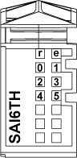

# Status LEDs

Status LEDs

The following figure shows the TM5SAI6TH status LEDs:

The table below shows the TM5SAI6TH status LEDs:

| LEDs | Color | Status | Description |
| --- | --- | --- | --- |
| r | Green | Off | No power supply |
| Single Flash | Reset state |
| Flashing | Preoperational state |
| On | Normal operation |
| e | Red | Off | OK or no power supply |
| On | Detected error or reset state |
| Single Flash | Detected error for an I/O channel. |
| e+r | Steady Red / Single Green Flash | | Invalid firmware |
| 0-5 | Green | Off | Channel not configured |
| Flashing | Overflow, underflow or broken wire detected |
| On | The analog/digital converter is running, value is available |