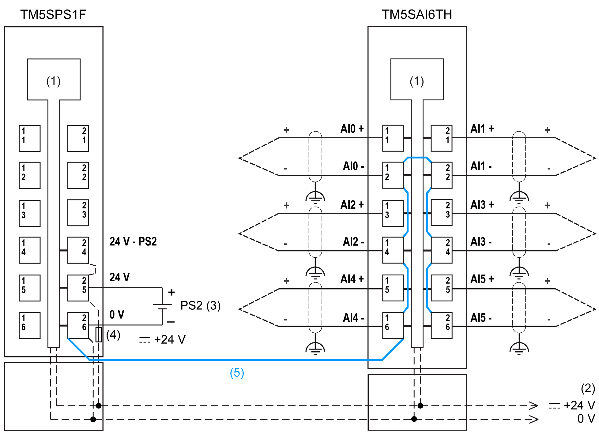

# Ceramic Heating Element with Integrated Thermo Elements

Ceramic Heating Element with Integrated Thermo Elements

Ripple voltage effects can potentially cause measurement errors.

|  |
| --- |
| Warning_Color.gifWARNING |
| RIPPLE VOLTAGE CAN CAUSE UNINTENDED EQUIPMENT OPERATION |
| Connect the negative input of the thermocouple element to the negative input of the power module that is supplying the thermocouple. |
| Failure to follow these instructions can result in death, serious injury, or equipment damage. |

The following figure shows the wiring diagram for TM5SAI6TH with a PDM:

(1):   Internal electronics

(2):   24 Vdc I/O power segment integrated into the bus bases

(3):   PS2: External isolated power supply 24 Vdc

(4):   Integrated fuse type T slow-blow 6.3 A 250 V exchangeable

(5):   Connection of the negative inputs of the thermocouple module with negative input of PDM