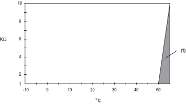
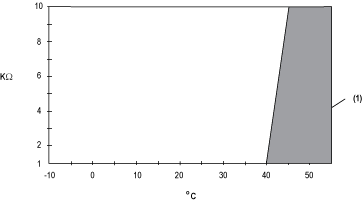

# De-rating the output load

De-rating the output load

The analog output modules can be configured as voltage outputs, current outputs, or a mix of voltage and current outputs. In the case of a mixed configuration, you must adjust the following de-rating information.

If only one of the outputs in the mix is configured as a current output, use the mean between the current and voltage curves. If more than one output in the mix is configured as a current output, use the current output de-rating curve. Otherwise, use the appropriate de-rating information as follows:

De-rating the voltage output load in a horizontal installation:

1   Invalid area

De-rating the current output load in a horizontal installation:

1   Invalid area

De-rating the voltage output load in a vertical installation:

1   Invalid area

De-rating the current output load in a vertical installation:

1   Invalid area