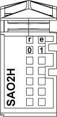

# Status LEDs

Status LEDs

The following figure shows the TM5SAO2H status LEDs:

The table below shows the TM5SAO2H status LEDs:

| LEDs | Color | Status | Description |
| --- | --- | --- | --- |
| r | Green | Off | No power supply |
| Single Flash | Reset state |
| Flashing | Preoperational state |
| On | Normal operation |
| e | Red | Off | OK or no power supply |
| On | Detected error or reset state |
| 0-1 | Yellow | Off | Value = 0 |
| On | Value ≠ 0 |