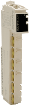

# TM5 Analog I/O Modules - Hardware Guide

TM5 Analog I/O Modules - Hardware Guide

TM5 Analog I/O Modules - Hardware Guide

This manual describes the hardware implementation of the ModiconTM5 Analog I/O modules. It provides parts descriptions, specifications, wiring diagrams, installation and setup for Modicon TM5 Analog I/O modules.

EIO0000003203.01

© 2020 Schneider Electric. All rights reserved.