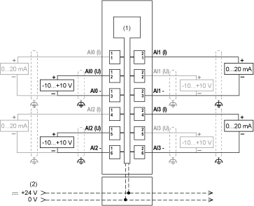

# TM5SAI4H Wiring Diagram

TM5SAI4H Wiring Diagram

Wiring Diagram

The following figure shows the wiring diagram for the TM5SAI4H:

1   Internal electronics

2   24 Vdc I/O power segment integrated into the bus bases

I   Current

U   Voltage

Use shielded, properly grounded cables for all analog and high-speed inputs or outputs and communication connections. If you do not use shielded cable for these connections, electromagnetic interference can cause signal degradation. Degraded signals can cause the controller or attached modules and equipment to perform in an unintended manner.

|  |
| --- |
| Warning_Color.gifWARNING |
| UNINTENDED EQUIPMENT OPERATION |
| oUse shielded cables for all fast I/O, analog I/O and communication signals.  oGround cable shields for all analog I/O, fast I/O and communication signals at a single point1.  oRoute communication and I/O cables separately from power cables. |
| Failure to follow these instructions can result in death, serious injury, or equipment damage. |

1Multipoint grounding is permissible if connections are made to an equipotential ground plane dimensioned to help avoid cable shield damage in the event of power system short-circuit currents.

|  |
| --- |
| Warning_Color.gifWARNING |
| UNINTENDED EQUIPMENT OPERATION |
| Do not connect wires to unused terminals and/or terminals indicated as “No Connection (N.C.)”. |
| Failure to follow these instructions can result in death, serious injury, or equipment damage. |

If you have physically wired the analog channel for a voltage signal and you configure the channel for a current signal in EcoStruxure Machine Expert, you may damage the analog circuit.

|  |
| --- |
| NOTICE |
| INOPERABLE EQUIPMENT |
| Verify that the physical wiring of the analog circuit is compatible with the software configuration for the analog channel. |
| Failure to follow these instructions can result in equipment damage. |

Condition of Installation

Do not place 16-bit analog input modules side-by-side because their electromagnetic character­istics may lead to mutual interference and possible unintended equipment operation. Further, other types of equipments can generate similar electromagnetic interference affecting the conversion accuracy of the modules. In the physical configuration, a single slice of non-interfering equipment is sufficient to avoid this type of disturbance. Separate the 16-bit analog modules from each other and from the following equipment:

oTM5SBER2 Bus receiver

oTM5SPS2 and TM5SPS2F Power Distribution Modules

oTM258••• and LMC058••• Controllers:

|  |
| --- |
| Warning_Color.gifWARNING |
| UNINTENDED EQUIPMENT OPERATION |
| oDo not place 16-bit analog input modules next to each other.  oDo not place 16-bit analog input modules in direct proximity to equipment that generate electromagnetic interference.  oInsert at least one non-interfering slice between any 16-bit analog input module and any interference generating equipment. |
| Failure to follow these instructions can result in death, serious injury, or equipment damage. |

EIO0000003203.01

© 2020 Schneider Electric. All rights reserved.