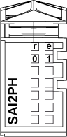

# TM5SAI2PH Presentation

TM5SAI2PH Presentation

Main Characteristics

The table below describes the main characteristics of the TM5SAI2PH electronic module:

| Main Characteristics | | |
| --- | --- | --- |
| Number of input channels | 2 | |
| Measurement type | Temperature | Resistance |
| Input sensor type | [PT100 or PT1000](../glossary/glossary.htm#XREF_D_SE_0024697_350) | - |
| Input range | -200°C...850°C | 0.1 Ω...4500 Ω / 0.05 Ω...2250 Ω |
| Resolution | 16-bit | |

Ordering Information

The following figure shows the slice with a TM5SAI2PH:

The table below shows the model numbers for the terminal block and bus base associated to TM5SAI2PH:

| Number | Model Number | Description | Color |
| --- | --- | --- | --- |
| 1 | TM5ACBM11  or  TM5ACBM15 | Bus base    Bus base with address setting | White    White |
| 2 | TM5ASAI2PH | Electronic module | White |
| 3 | TM5ACTB06  or  TM5ACTB12 | Terminal block, 6 pins    Terminal block, 12 pins | White    White |

NOTE: For more information, refer to [TM5 bus bases and terminal blocks](../../../../../../api/crossBook?lang=en-US&virtualBookName=m258pig&topicID=D_SE_0004365_1)

Status LEDs

The following figure shows the LEDs for TM5SAI2PH:

The table below shows the TM5SAI2PH status LEDs:

| LEDs | Color | Status | Description |
| --- | --- | --- | --- |
| r | Green | Off | No power supply |
| Single Flash | Reset state |
| Flashing | Preoperational state |
| On | Normal operation |
| e | Red | Off | OK or no power supply |
| On | Detected error or reset state |
| Single Flash | Detected error for an I/O channel. |
| e+r | Steady Red / Single Green Flash | | Invalid firmware |
| 0-1 | Green | Off | Channel not configured |
| Flashing | Overflow, underflow or broken wire detected |
| On | The analog/digital converter is running, value is available |

EIO0000003203.01

© 2020 Schneider Electric. All rights reserved.