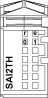

# TM5SAI2TH Presentation

TM5SAI2TH Presentation

Main Characteristics

The table below describes the main characteristics of the TM5SAI2TH module:

| Main Characteristics | | |
| --- | --- | --- |
| Number of input channels | 2 | |
| Measurement type | Temperature | Voltage |
| Input sensor type | J, K, N, S, B and R thermocouple sensors |  |
| Input range | Type J: -210...1200°C (-346...2192°F)  Type K: -270...1372°C (-454...2501°F)  Type N: -270...1300°C (-454...2372°F)  Type S: -50...1768°C (-58...3214°F)  Type B: 0...1820°C (32...3308°F)  Type R: -50...1768°C (-58...3214°F)  1 µV per bit  2 µV per bit | ± 65.534 mV |
| Resolution | 16-bit | |

The thermocouple modules are configured as a whole for the same type of thermocouple sensor. You cannot mix thermocouple sensor types on the same module, otherwise the temperature readings will not be correct.

|  |
| --- |
| Warning_Color.gifWARNING |
| UNINTENDED EQUIPMENT OPERATION |
| oOnly connect thermocouple sensors of the same type to the temperature module.  oConfigure the module for the correct type of thermocouple. |
| Failure to follow these instructions can result in death, serious injury, or equipment damage. |

Ordering Information

The following figure shows the slice with a TM5SAI2TH:

The table below shows the model numbers for the terminal block and bus base associated to TM5SAI2TH:

| Number | Model Number | Description | Color |
| --- | --- | --- | --- |
| 1 | TM5ACBM11  or  TM5ACBM15 | Bus base    Bus base with address setting | White    White |
| 2 | TM5ASAI2TH | Electronic module | White |
| 3 | TM5ACTB06  or  TM5ACTB12 | Terminal block, 6 pins    Terminal block, 12 pins | White    White |

NOTE: For more information, refer to [TM5 bus bases and terminal blocks](../../../../../../api/crossBook?lang=en-US&virtualBookName=m258pig&topicID=D_SE_0004365_1)

Status LEDs

The following figure shows theTM5SAI2TH status LEDs:

The table below shows theTM5SAI2TH status LEDs:

| LEDs | Color | Status | Description |
| --- | --- | --- | --- |
| r | Green | Off | No power supply |
| Single Flash | Reset state |
| Flashing | Preoperational state |
| On | Normal operation |
| e | Red | Off | OK or no power supply |
| On | Detected error or reset state |
| Single Flash | Detected error for an I/O channel. |
| e+r | Steady Red / Single Green Flash | | Invalid firmware |
| 0-1 | Green | Off | Channel not configured |
| Flashing | Overflow, underflow or broken wire detected |
| On | The analog/digital converter is running, value is available |

EIO0000003203.01

© 2020 Schneider Electric. All rights reserved.