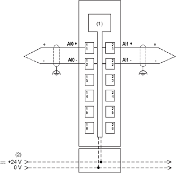
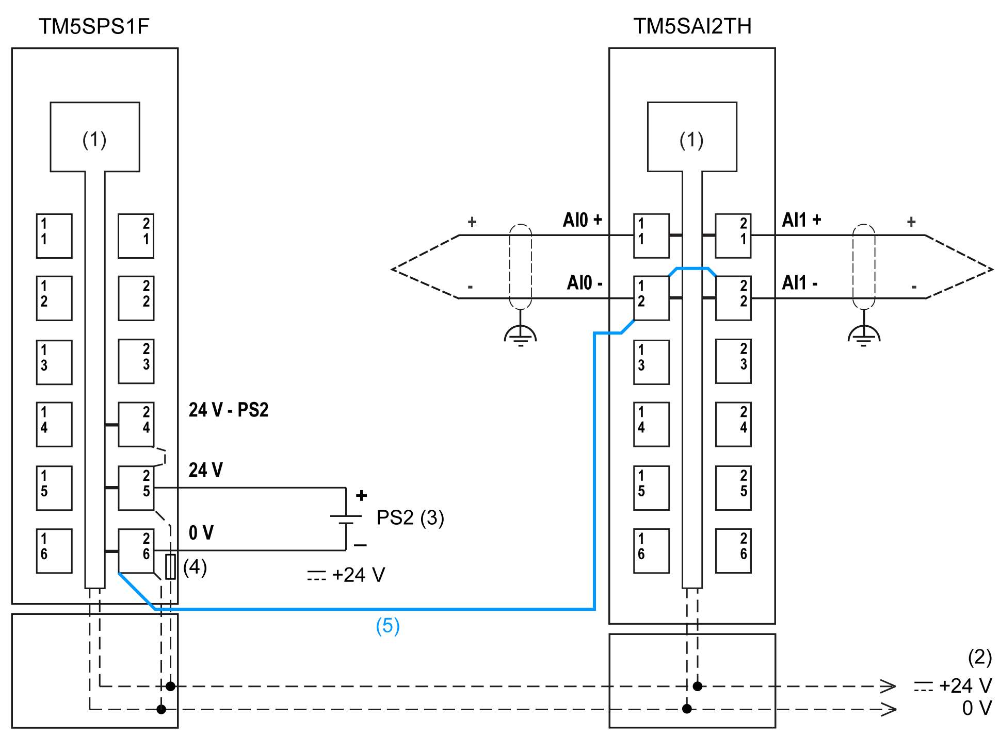

# TM5SAI2TH Wiring Diagram

TM5SAI2TH Wiring Diagram

Wiring Diagram

The following figure shows the wiring diagram for TM5SAI2TH:

(1):   Internal electronics

(2):   24 Vdc I/O power segment integrated into the bus bases

Use shielded, properly grounded cables for all analog and high-speed inputs or outputs and communication connections. If you do not use shielded cable for these connections, electromagnetic interference can cause signal degradation. Degraded signals can cause the controller or attached modules and equipment to perform in an unintended manner.

|  |
| --- |
| Warning_Color.gifWARNING |
| UNINTENDED EQUIPMENT OPERATION |
| oUse shielded cables for all fast I/O, analog I/O and communication signals.  oGround cable shields for all analog I/O, fast I/O and communication signals at a single point1.  oRoute communication and I/O cables separately from power cables. |
| Failure to follow these instructions can result in death, serious injury, or equipment damage. |

1Multipoint grounding is permissible if connections are made to an equipotential ground plane dimensioned to help avoid cable shield damage in the event of power system short-circuit currents.

|  |
| --- |
| Warning_Color.gifWARNING |
| UNINTENDED EQUIPMENT OPERATION |
| Do not connect wires to unused terminals and/or terminals indicated as “No Connection (N.C.)”. |
| Failure to follow these instructions can result in death, serious injury, or equipment damage. |

Ceramic Heating Element with Integrated Thermo Elements

Ripple voltage effects can potentially cause measurement errors.

|  |
| --- |
| Warning_Color.gifWARNING |
| RIPPLE VOLTAGE CAN CAUSE UNINTENDED EQUIPMENT OPERATION |
| Connect the negative input of the thermocouple element to the negative input of the power module that is supplying the thermocouple. |
| Failure to follow these instructions can result in death, serious injury, or equipment damage. |

The following figure shows the wiring diagram for TM5SAI2TH with a PDM:

(1):   Internal electronics

(2):   24 Vdc I/O power segment integrated into the bus bases

(3):   PS2: External isolated power supply 24 Vdc

(4):   Integrated fuse type T slow-blow 6.3 A 250 V exchangeable

(5):   Connection of the negative inputs of the thermocouple module with negative input of PDM

EIO0000003203.01

© 2020 Schneider Electric. All rights reserved.