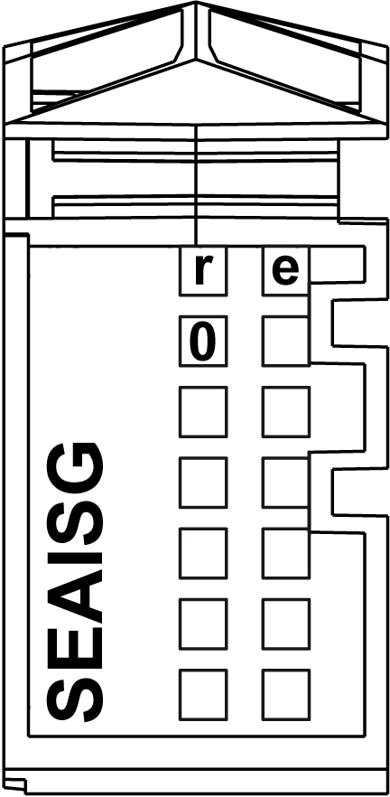

# TM5SEAISG Presentation

TM5SEAISG Presentation

Main Characteristics

The table below describes the main characteristics of the TM5SEAISG module:

| Main Characteristics | |
| --- | --- |
| Number of input channels | 1 |
| Measurement type | Full-bridge strain gauge |
| Sensor operating range | 85...5000 Ω |
| Resolution | 24-bit |

For configuring and programming your TM5SEAISG electronic module, refer to [IoDrvTM5SEAISG Strain Gauge Library Guide](../../../../../../api/crossBook?lang=en-US&virtualBookName=TM5sglib&topicID=D_SE_0020316_6).

Ordering Information

The following figure shows the slice with a TM5SEAISG:

The table below shows the model numbers for the terminal block and bus base associated to TM5SEAISG:

| Number | Model Number | Description | Color |
| --- | --- | --- | --- |
| 1 | TM5ACBM11  or  TM5ACBM15 | Bus base    Bus base with address setting | White    White |
| 2 | TM5SEAISG | Electronic module | White |
| 3 | TM5ACTB12 | Terminal block, 12 pins | White |

NOTE: For more information, refer to [TM5 bus bases and terminal blocks](../../../../../../api/crossBook?lang=en-US&virtualBookName=m258pig&topicID=D_SE_0004365_1)

Status LEDs

The following figure shows theTM5SEAISG status LEDs:

The table below shows theTM5SEAISG status LEDs:

| LEDs | Color | Status | Description |
| --- | --- | --- | --- |
| r | Green | Off | No power supply |
| Single Flash | Reset state |
| Flashing | Preoperational state |
| On | Normal operation |
| e | Red | Off | OK or no power supply |
| On | Detected error or reset state |
| 0 | Green | Off | Broken wire detected  The analog/digital converter is busy |
| On | The analog/digital converter is running, value is available |

EIO0000003203.01

© 2020 Schneider Electric. All rights reserved.