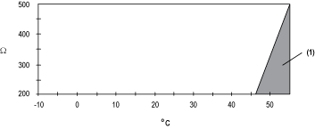
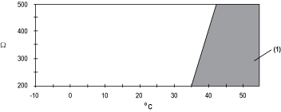

# TM5SAO4H Characteristics

TM5SAO4H Characteristics

Introduction

This is the description characteristics for the TM5SAO4H electronic module.

See also [Environmental Characteristics](../TM5_-_General_Rules_for_Implementing/TM5_-_General_Rules_for_Implementing-4.htm#XREF_D_SE_0002647_1).

|  |
| --- |
| Danger_Color.gifDANGER |
| FIRE HAZARD |
| Use only the correct wire sizes for the maximum current capacity of the power supplies. |
| Failure to follow these instructions will result in death or serious injury. |

|  |
| --- |
| Warning_Color.gifWARNING |
| UNINTENDED EQUIPMENT OPERATION |
| Do not exceed any of the rated values specified in the environmental and electrical characteristics tables. |
| Failure to follow these instructions can result in death, serious injury, or equipment damage. |

General Characteristics

The table below describes the general characteristics of the TM5SA04H electronic module:

| General Characteristics | |
| --- | --- |
| Rated power supply voltage            Power supply source | 24 Vdc  Connected to the 24 Vdc I/O power segment |
| Power supply range | 20.4...28.8 Vdc |
| 24 Vdc I/O segment current draw | 63 mA |
| TM5 Bus 5 Vdc current draw | 2 mA |
| Power dissipation | 1.51 W max. |
| Weight | 25 g (0.9 oz) |
| ID code for firmware update | 7077 dec |

Output Characteristics

The table below describes the output characteristics of the TM5SA04H electronic module:

| Characteristic | | Voltage Output | Current Output |
| --- | --- | --- | --- |
| Output range | | -10...+10 Vdc | 0...20 mA |
| Output impedance | | 1 kΩ min. | - |
| Load impedance | | +/- 10 mA max | 200 Ω min. 500 Ω max. |
| Sample duration time | | 50 µs for all outputs | |
| Output type | | Differential | |
| Response time for output change | | 1 ms max. | |
| Over voltage before output change (Response time) | | +/- 15% of the Full scale (20V) | - |
| Over current before output change (Response time) | | - | +/- 10% of the Full scale (20mA) |
| Output tolerance - maximum deviation at ambient 25° C (77° F) | | < 0.04% of the measurement | |
| Output tolerance - temperature drift | | 0.01% / °C of the measurement | |
| Output tolerance - non linearity | | < 0.005% of the full scale (20 Vdc) | < 0.005% of the full scale (20 mA) |
| De-rating \* | | See note \* | |
| Output tolerance - maximum deviation caused by load change | | 0.02% from 10 MΩ to 1 kΩ, resistive | 0.5% from 1 Ω to 500 Ω, resistive |
| Digital resolution | | 15 bits + sign | 15 bits |
| Resolution value | | 305.176 µV | 610.352 nA |
| Noise resistance - cable | | Shielded cable is necessary | |
| Isolation between channels | | Not isolated | |
| Isolation between channels and bus | | See note 1. | |
| Output protection | | Short circuit protection: current limitation is 40 mA | |
| \* Note: These analog electronic modules are subject to operating temperature restrictions between 55 and 60 °C (131 and 140 °F). If the ambiant temperature of your installation may exceed 55 °C (131 °F), do not install the TM5SAI•H modules adjacent to other devices capable of dissipating more than 1.15 W. For more information refer to [Enclosing the TM5 System](../../../../../../api/crossBook?lang=en-US&virtualBookName=m258pig&topicID=D_SE_0001563_1). | | | |

1 The isolation of the electronic module is 500 Vac RMS between the electronics powered by the TM5 bus and those powered by 24 Vdc I/O power segment connected to the module. In practice, the TM5 electronic module is installed in the bus base, and there is a bridge between the TM5 power bus and the 24 Vdc I/O power segment. The two power circuits reference the same functional ground (FE) through specific components designed to reduce effects of electromagnetic interference. These components are rated at 30 Vdc or 60 Vdc. This effectively reduces isolation of the entire system from the 500 Vac RMS.

De-rating the output load

The analog output modules can be configured as voltage outputs, current outputs, or a mix of voltage and current outputs. In the case of a mixed configuration, you must adjust the following de-rating information.

If only one of the outputs in the mix is configured as a current output, use the mean between the current and voltage curves. If more than one output in the mix is configured as a current output, use the current output de-rating curve. Otherwise, use the appropriate de-rating information as follows:

De-rating the voltage output load in a horizontal installation:

1   Invalid area

De-rating the current output load in a horizontal installation:

1   Invalid area

De-rating the voltage output load in a vertical installation:

1   Invalid area

De-rating the current output load in a vertical installation:

1   Invalid area

EIO0000003203.01

© 2020 Schneider Electric. All rights reserved.